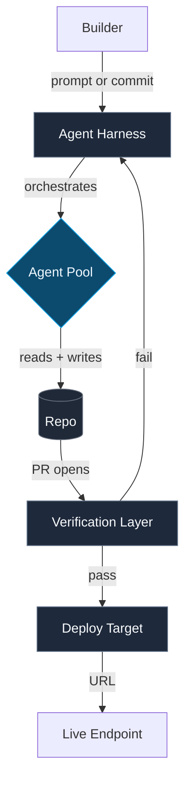
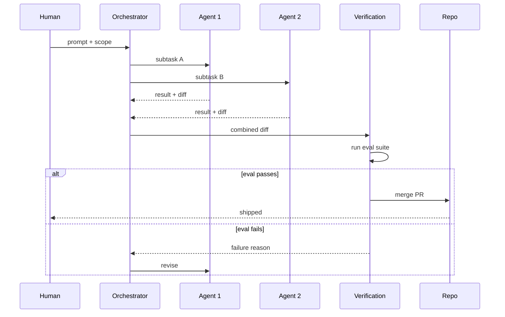
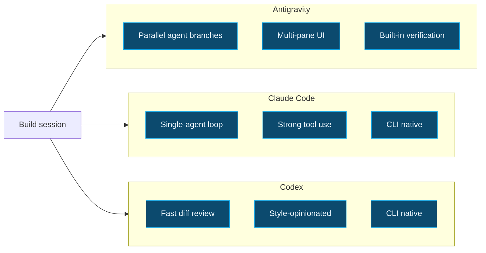

# Diagram Prompt — Mermaid Templates

Output goes to `drafts/diagrams/[slug].mmd`. The MDX renderer on frankx.ai supports inline Mermaid via ` ```mermaid ` fences, so the same source ships to the build log and the demo brief.

## Choosing a template

| Build type | Use template |
|---|---|
| New tool or harness, want to show layers | Stack diagram (graph TD) |
| Agent loop or verification flow | Agent flow (sequenceDiagram) |
| Tool comparison or eval | Comparison matrix (graph LR) |

Pick one. Resist the urge to ship all three for one build. The diagram exists to make one point.

## Rendering

Render with Mermaid CLI:

```bash
npx -y @mermaid-js/mermaid-cli -i drafts/diagrams/<slug>.mmd -o drafts/diagrams/<slug>.svg -t dark -b transparent
```

If the `oracle-diagram-generator` skill is available in the current session, prefer it for higher-fidelity output. Otherwise the Mermaid CLI is fine.

## Template 1 — Stack diagram

For a build that wants to show the layers from user input down to deploy. Use when the build introduces a new harness, MCP server, or tool integration.



Fill-in rules:

- `Agent Harness` — name the specific tool (Antigravity, Claude Code, Aider).
- `Agent Pool` — number and role of agents.
- `Verification Layer` — what the gate actually checks.
- `Deploy Target` — Vercel, Fly, Modal, etc.

## Template 2 — Agent flow

For a build where the story is the loop. Use when the receipt is the sequence of agent handoffs.



Fill-in rules:

- Rename `Agent 1` and `Agent 2` to the actual agents.
- The `alt` block stays — it forces the diagram to show both the pass and the fail path.
- If there are more than two agents, add participants. Do not exceed five — beyond five the diagram becomes unreadable.

## Template 3 — Comparison matrix

For a build that's really a tool eval. Use when the artifact is `Tool A vs Tool B vs Tool C` and the build log is making a recommendation.



Fill-in rules:

- Replace the three subgraphs with the tools actually compared.
- Three bullets per tool max. If a tool has more than three differentiators, you're not making a clean comparison.
- The arrows from `Build` to each tool show that the same build session was the eval driver.

## Output rules

- Filename: `drafts/diagrams/<slug>.mmd`.
- File starts with a one-line comment: `%% <build name> — <template choice>`.
- No banned terms in any node label or comment.
- Run the render once to confirm syntax before committing.

## Embedding in the MDX

Paste the Mermaid source into the build log MDX inside a ` ```mermaid ` fence. The site renderer handles the rest. Do not link to an SVG unless the diagram is too large for inline (over 30 nodes).

Example inline embed in the MDX:

````

````
