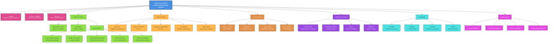
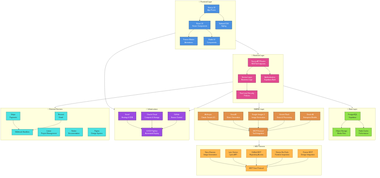
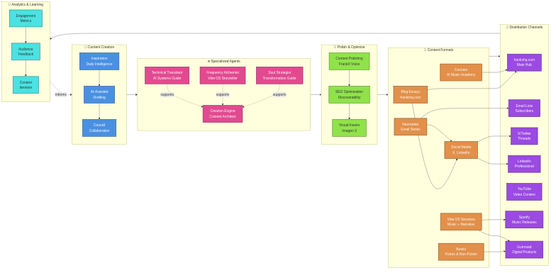
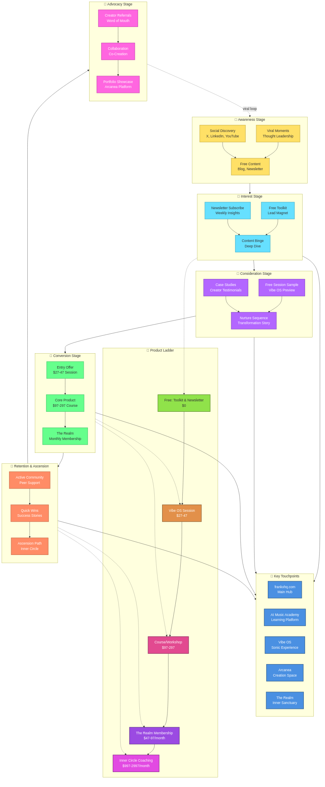

# FrankX.ai - Elite Creator & AI Architect Platform

Modern creator platform built on Next.js 16 with AI-powered content generation, multi-agent orchestration, and enterprise-grade architecture patterns. Powers [frankx.ai](https://frankx.ai).

## Live Site

| Hub | URL | Description |
|-----|-----|-------------|
| Homepage | [frankx.ai](https://frankx.ai) | Elite creator value prop |
| Products | [/products](https://frankx.ai/products) | Digital products & tools |
| Blog | [/blog](https://frankx.ai/blog) | AI tutorials & insights |
| AI Architect | [/ai-architect](https://frankx.ai/ai-architect) | Enterprise AI patterns |
| Music Lab | [/music-lab](https://frankx.ai/music-lab) | Suno AI & music production |
| Resources | [/resources](https://frankx.ai/resources) | Free downloads & templates |
| Links | [/links](https://frankx.ai/links) | Social links hub |

## Tech Stack

| Layer | Technology |
|-------|------------|
| Framework | **Next.js 16.1** with App Router & Turbopack |
| Language | TypeScript (strict mode) |
| Styling | Tailwind CSS v4 + custom design tokens |
| Content | MDX with custom components |
| Hosting | Vercel (Edge Functions, ISR) |
| Email | Resend + React Email templates |
| Analytics | Vercel Analytics + Plausible |
| AI | Claude Code + ACOS skill system |

## Project Status (Last Updated: 2026-01-13)

**Phase**: Phase 1/2 transition (Foundation → Product Suite).  
**Focus**: Stabilize core site quality, complete Vibe OS, launch initial digital products, and activate the 6‑agent team.

### Known Health Signals
- **TypeScript**: ~256 errors reported in the latest status report, including a critical blog form action mismatch and `GlassmorphicCard` prop issues.  
- **Linting**: Currently disabled pending ESLint flat config migration.  
- **Submodule Noise**: `arcanea-opencode` errors may be inflating TypeScript counts.

> For full details, see `repo_status_report.md`.

## AI-Powered Development

This site is built and maintained with **Agentic Creator OS (ACOS)** - a multi-agent system for content creation and site development.

### Key Commands

```bash
# Content generation
/infogenius          # Research-grounded visual generation
/superintelligence   # Deep analysis for complex decisions
/article-creator     # Blog post generation pipeline
/suno-prompt         # Music prompt engineering

# Development
/code-review         # Automated code review
/verify-deploy       # Deployment verification
/planning-with-files # Structured task planning
```

### Skill System

40+ specialized skills organized into pillars:
- **Creative**: Content, music, visuals
- **Technical**: Architecture, development, DevOps
- **Business**: Strategy, products, marketing
- **Personal**: Productivity, learning
- **System**: Orchestration, planning, memory

## Ecosystem Overview

### System Architecture



The FrankX platform operates as a unified creator ecosystem with four core layers:

| Layer | Purpose | Components |
|-------|---------|------------|
| **ACOS** | Agentic Creator OS | 25 commands, 80+ skills, 40+ agents |
| **Content Engine** | Multi-format creation | Blog, music, visuals, products |
| **Distribution** | Multi-platform reach | Web, social, email, community |
| **Infrastructure** | Production backbone | Vercel, Supabase, R2, Inngest |

### Technical Architecture



### Content Pipeline



### Creator Journey



### All Diagrams

| Diagram | Description |
|---------|-------------|
| [01-ecosystem-overview](docs/diagrams/01-ecosystem-overview.png) | Complete system map |
| [02-tech-stack-architecture](docs/diagrams/02-tech-stack-architecture.png) | Technology layers |
| [03-content-universe-flow](docs/diagrams/03-content-universe-flow.png) | Content pipeline |
| [04-creator-journey-funnel](docs/diagrams/04-creator-journey-funnel.png) | User progression |
| [05-agentic-ai-architecture](docs/diagrams/05-agentic-ai-architecture.png) | AI agent system |
| [06-vibe-os-production-flow](docs/diagrams/06-vibe-os-production-flow.png) | Product workflow |
| [07-product-ladder-detailed](docs/diagrams/07-product-ladder-detailed.png) | Product funnel |
| [08-brand-identity-system](docs/diagrams/08-brand-identity-system.png) | Brand architecture |
| [09-arcanea-platform-architecture](docs/diagrams/09-arcanea-platform-architecture.png) | Arcanea gates |
| [10-ai-music-academy-structure](docs/diagrams/10-ai-music-academy-structure.png) | Music production |
| [11-newsletter-blog-flow](docs/diagrams/11-newsletter-blog-flow.png) | Email + content |
| [12-data-flow-architecture](docs/diagrams/12-data-flow-architecture.png) | Data pipeline |

## Architecture

```
app/                    # Next.js App Router pages
├── products/           # Product landing pages
├── blog/               # Blog with MDX content
├── ai-architect/       # Enterprise AI hub
├── music-lab/          # Music production hub
├── resources/          # Downloads & templates
└── api/                # API routes

components/             # React components
├── ui/                 # Design system primitives
├── sections/           # Page sections
├── home/               # Homepage variants
└── blog/               # Blog components

content/                # MDX content
├── blog/               # 50+ articles
└── guides/             # Resource guides

lib/                    # Utilities
├── blog.ts             # Blog utilities
├── prompts.ts          # Prompt library (400+)
└── team-members.ts     # AI team definitions

public/                 # Static assets
├── images/             # Optimized images
└── reading/            # Generated reading site
```

## Development

```bash
# Install
npm install

# Dev server (localhost:3000)
npm run dev

# Quality checks
npm run lint && npm run type-check

# Production build
npm run build

# Preview production
npm run start
```

### Quality & QA (Recommended)

```bash
# TypeScript only (reduce noise if submodules are excluded)
npm run type-check

# Linting (after ESLint flat config migration)
npm run lint
```

## Deployment

Two-repo architecture for security:

```
FrankX (Private)                    Production (Public)
├── .claude/         ─── private
├── research/        ─── private
├── app/             ───────────►   ├── app/
├── components/      ───────────►   ├── components/
├── content/         ───────────►   ├── content/
└── public/          ───────────►   └── public/
```

**Deploy workflow:**
```bash
# 1. Develop in FrankX repo
# 2. Copy to production worktree
cp -r content/blog/* .worktrees/vercel-ui-ux/content/blog/

# 3. Commit and push
cd .worktrees/vercel-ui-ux
git add -A && git commit -m "feat: update" && git push
```

## Products

| Product | Price | Description |
|---------|-------|-------------|
| Vibe OS | $37 | Life design system in Notion |
| Creative AI Toolkit | $47 | Prompt templates & workflows |
| Suno Prompt Library | $27 | 400+ music prompts |
| ACOS | $297+ | Multi-agent creator system |
| Creation Chronicles | $497+ | Premium content course |

## Performance Targets

| Metric | Target |
|--------|--------|
| Lighthouse | >90 |
| LCP | <2.5s |
| FID | <100ms |
| CLS | <0.1 |

## Branching & Releases

This repo’s working branch is tracked locally. If you need a quick status snapshot:

```bash
git status -sb
git log -5 --oneline
```

For broader historical context (branch comparison/testing), see `BRANCH-STATUS-AND-TESTING.md`.

## Brand

**Frank = Elite Creator + AI Architect**

- 500+ AI songs created
- Oracle AI Architect certified
- Enterprise-grade systems
- Humble excellence in execution

---

Built with Next.js 16, TypeScript, and Claude Code.

Copyright FrankX. All rights reserved.
