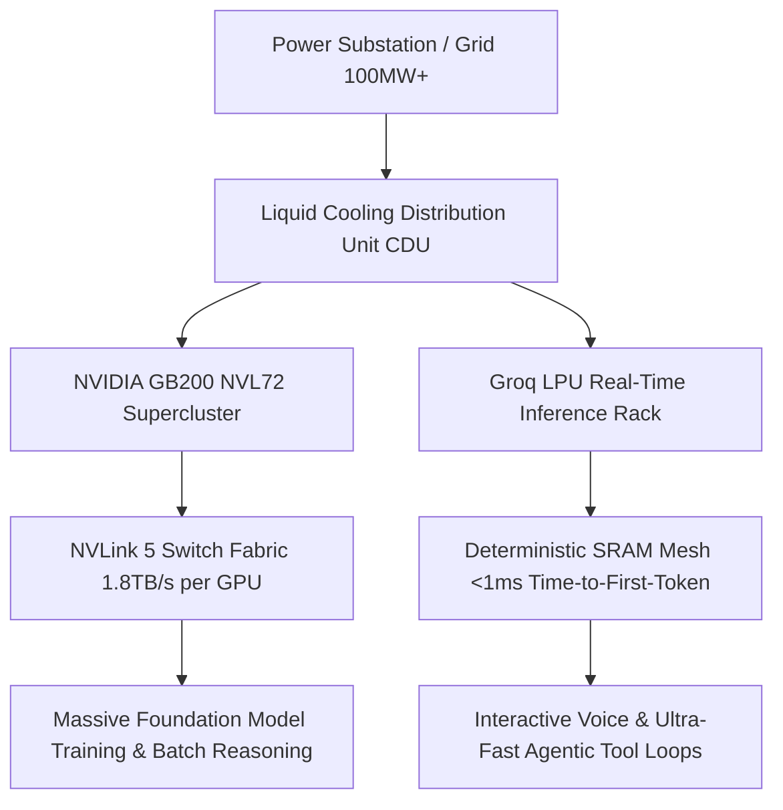

The industrialization of artificial intelligence is fundamentally a thermodynamics and networking problem. The limiting factors of modern AI scaling are no longer algorithmic alone; they are **power delivery (megawatts per facility), thermal dissipation (liquid cooling at the rack level), and interconnect bandwidth (NVLink / RoCEv2 / InfiniBand)**.

This architectural analysis dissects the shift from isolated GPU clusters to multi-megawatt **AI Factories**.



---

## 1. The Physics of the AI Factory: Power, Density, and Cooling

Traditional enterprise datacenters were engineered for 10 to 15 kW per rack. In contrast, modern AI compute architectures like the **NVIDIA GB200 NVL72** consume up to **120 kW to 140 kW per rack**. Air cooling at this thermal density is physically impossible due to fan power limits and heat transfer physics.

### Key Datacenter Infrastructure Requirements
- **Direct-to-Chip (D2C) Liquid Cooling**: Deionized water-glycol mixtures flowing through micro-channel cold plates directly attached to GPU and CPU dies.
- **Cooling Distribution Units (CDUs)**: Secondary loops isolating facility water from delicate rack plumbing, maintaining supply temperatures of 25°C to 35°C.
- **Facility-Level Power Redundancy**: 48V to 400V DC distribution inside the rack to eliminate dual conversion losses and copper busbar thickness.

---

## 2. NVIDIA Blackwell GB200 NVL72 Architecture

The Blackwell GB200 NVL72 operates as a single unified super-chip rather than 72 independent servers:

```
┌─────────────────────────────────────────────────────────────┐
│                    GB200 NVL72 SINGLE RACK                  │
├─────────────────────────────────────────────────────────────┤
│  • 36 Grace CPUs (ARM Neoverse V2)                          │
│  • 72 Blackwell GPUs (1.44 Exaflops FP4 AI Inference)      │
│  • 30 TB Fast HBM3e Memory (576 TB/s aggregate bandwidth)   │
│  • 9 NVLink Switch Trays (130 TB/s all-to-all bisection)    │
│  • Full Liquid-Cooled Copper Interconnect Spine             │
└─────────────────────────────────────────────────────────────┘
```

The primary engineering breakthrough of NVL72 is the **NVLink Spine**: replacing optical transceivers with passive copper cartridges across the 72-GPU mesh. This eliminates optical failure points, saves 20 kW of power per rack, and provides **1.8 TB/s bidirectional bandwidth per GPU**.

---

## 3. LPUs vs. GPUs: The Latency Economics of Agentic Inference

While GPUs dominate large-batch training and throughput, **LPUs (Language Processing Units)** pioneered by Groq take an alternative architectural route: replacing high-latency DRAM/HBM with **pure on-chip SRAM**.

| Feature | GPU Cluster (HBM3e) | Groq LPU (On-Chip SRAM) |
|---|---|---|
| **Memory Architecture** | External High Bandwidth Memory | 230 MB ultra-fast on-chip SRAM |
| **Memory Bandwidth** | 8 TB/s per chip | 80 TB/s per chip |
| **Execution Model** | Non-deterministic dynamic scheduling | Fully deterministic spatial compiler scheduling |
| **Time-to-First-Token** | 150ms – 500ms | Under 15ms |
| **Token Generation Velocity** | 50 – 120 tokens/sec | 500 – 800 tokens/sec |
| **Ideal Workload** | Massive batch processing & training | Real-time voice agents, sub-second agent loops |

For multi-agent swarms executing dozens of sequential tool calls and trajectory validations, LPU inference latency reductions compress a 30-second multi-turn agent workflow into **2.5 seconds**.

---

## 4. Total Cost of Ownership (TCO) & Unit Economics

Evaluating infrastructure by GPU rental cost per hour ($/hr) is a flawed procurement strategy. Enterprise infrastructure architects evaluate **Cost per Million Verified Outcomes**:

```
Cost per Outcome = (Infrastructure Cost/Hour × Execution Time) / Verification Pass Rate
```

When an agentic system uses faster hardware with higher deterministic verification rates, total operational expenditure decreases even if the hourly compute cost is higher.

---

## 5. Enterprise Cloud Deployments: OCI Superclusters

In enterprise environments, infrastructure deployment patterns center around high-performance interconnect fabrics:

- **OCI (Oracle Cloud Infrastructure) Superclusters**: Deploying up to 65,536 Blackwell GPUs over ultra-low-latency RoCEv2 (RDMA over Converged Ethernet) fabrics.
- **Data Sovereignty & Local Enclaves**: Meeting strict EU AI Act and regulatory requirements by isolating data pipelines within local sovereign cloud boundaries.
- **Bare-Metal Performance**: Zero virtualization overhead for direct hardware performance in high-throughput training and inference runs.

### Architectural Recommendations
1. **Tier Compute by Workload Phase**: Use GPU clusters (H100/H200/B200) for heavy context retrieval and batch generation; route interactive conversational and tool-dispatch loops to high-velocity LPU / Flash tiers.
2. **Design for Power Density**: Ensure facility contracts account for liquid-cooled rack requirements before purchasing high-density compute blocks.
3. **Optimize Token Lifetime**: Implement aggressive semantic caching and KV-cache reuse to reduce redundant computation on repeated system instructions.
