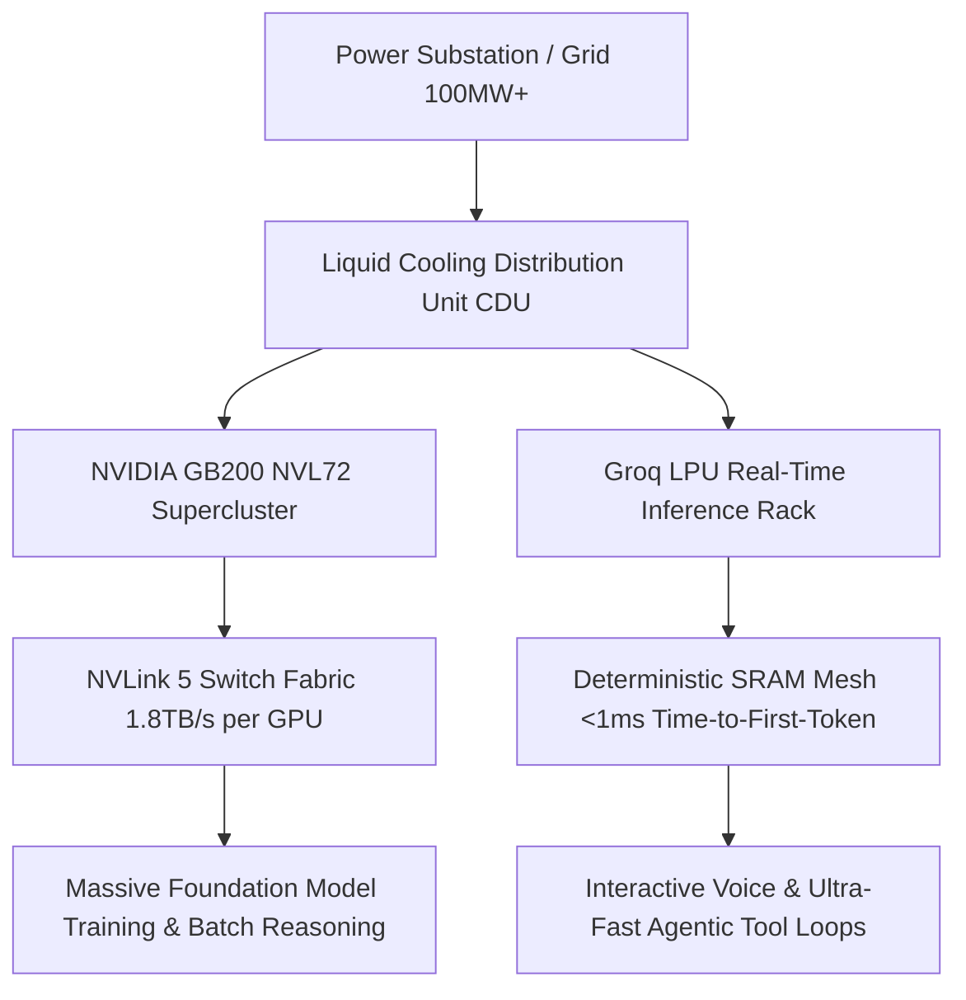

---
<<<<<<< HEAD
title: "AI Infrastructure Economics: Blackwell, LPUs & Sovereign AI Factories"
description: "Datacenter power scaling, liquid cooling manifolds, GB200 NVL72 clusters, Groq LPUs, Cerebras WSE-3, and multi-cloud hyperscaler compute economics across AWS, GCP, Azure, and CoreWeave."
=======
title: "AI Infrastructure & Hardware Economics: Blackwell, LPUs, and AI Factories"
description: "Analysis of datacenter power constraints, liquid cooling manifolds, GB200 NVL72 architectures, Groq LPU economics, and OCI Superclusters."
>>>>>>> origin/main
date: "2026-08-18"
category: "AI Architecture"
tags:
  - "ai-infrastructure"
  - "blackwell-b200"
  - "groq-lpus"
<<<<<<< HEAD
  - "cerebras-cs3"
  - "ai-factories"
  - "hardware-economics"
  - "liquid-cooling"
image: "/images/blog/generated/ai-infrastructure-factories.jpg"
featured: true
flagship: true
flagshipOrder: 4
readingGoal: "Master the physical constraints, thermodynamics, silicon architectures, and financial economics of high-density AI clusters across GPUs, LPUs, TPUs, and sovereign on-premise AI factories."
tldr: "AI infrastructure has transitioned from traditional server racks to megawatt-scale AI factories. NVIDIA GB200 NVL72 liquid-cooled racks solve high-bandwidth inter-chip communication, Groq LPUs and Cerebras WSE-3 optimize ultra-low latency token generation, and custom ASICs (Google TPU v6e, AWS Trainium2) establish specialized economics across the hyperscaler landscape."
architectNote: "Evaluate infrastructure not by raw GPU hourly rental prices, but by Cost Per Verified Outcome. Factor in memory bandwidth bottlenecks, interconnect topology (NVLink copper vs. InfiniBand/RoCEv2), thermal density (kW/rack), and token generation latency for multi-turn agent swarms."
publishedAt: "2026-08-18"
lastUpdated: "2026-08-18"
author: "Frank Riemer"
series:
  slug: "ai-infrastructure-series-2026"
  title: "Frontier AI Infrastructure & Compute Economics"
  part: 1
  total: 5
---

The industrialization of artificial intelligence is fundamentally a problem of **thermodynamics, silicon architecture, and interconnect physics**. As frontier models scale into multi-trillion-parameter reasoning systems, the computational bottleneck has shifted from raw algorithmic design to three hard physical constraints:

1. **Power Delivery & Grid Capacity**: Facilities requiring 100MW to 500MW substations with high-voltage DC distribution.
2. **Thermal Dissipation & Fluid Dynamics**: Direct-to-chip liquid cooling manifolds managing 120kW to 140kW per rack.
3. **Bisection Interconnect Bandwidth**: Massive multi-terabyte-per-second switching fabrics (NVLink 5, RoCEv2, Ultra Ethernet) preventing distributed tensor-parallel stalls.

This architectural treatise provides a sovereign, vendor-neutral analysis of the global AI compute landscape—spanning NVIDIA Blackwell, Groq LPUs, Cerebras Wafer-Scale systems, hyperscaler custom ASICs, and sovereign on-premise infrastructure.

<EcosystemStack
  title="Hardware Architecture & Compute Ecosystem"
  items={["nvidia", "groq", "cerebras", "antigravity", "openai", "omega"]}
/>


```
┌─────────────────────────────────────────────────────────────────────────────┐
│                 SOVEREIGN AI FACTORY INFRASTRUCTURE TOPOLOGY                │
├─────────────────────────────────────────────────────────────────────────────┤
│  Grid Ingress: High-Voltage Substation (100MW–500MW) ──► 400V DC Busbar     │
│       │                                                                     │
│       ▼                                                                     │
│  [Cooling Distribution Units (CDUs) · Direct-to-Chip Liquid Manifolds]      │
│       │                                                                     │
│       ├──► [NVIDIA GB200 NVL72 Superclusters] ──► NVLink 5 Spine (1.8 TB/s) │
│       │         │                                                           │
│       │         ▼ (Massive Batch Inference & Multi-Modal Pre-Training)      │
│       │                                                                     │
│       ├──► [Groq LPU Inference Racks] ─────────► On-Chip SRAM (80 TB/s)     │
│       │         │                                                           │
│       │         ▼ (Sub-15ms Time-to-First-Token Agentic Tool Loops)         │
│       │                                                                     │
│       ├──► [Cerebras CS-3 Wafer-Scale Clusters] ─► 44GB On-Wafer SRAM       │
│       │         │                                                           │
│       │         ▼ (Extreme Token Velocity & Scientific Simulation)          │
│       │                                                                     │
│       └──► [Hyperscaler Custom Silicon] ───────► TPU v6e / Trainium2 / Maia │
│                 │                                                           │
│                 ▼ (Specialized Workload Cost Optimization)                  │
└─────────────────────────────────────────────────────────────────────────────┘
```


---

## 1. The Thermodynamics of the Modern AI Factory

Traditional enterprise datacenters were engineered for standard server densities of **8 kW to 15 kW per rack**, relying entirely on chilled air convection. Modern AI clusters like the **NVIDIA GB200 NVL72** draw **120 kW to 140 kW per rack**.

At this thermal density, air cooling fails due to the physical limits of airflow resistance and fan power consumption. Modern facilities must implement **Direct-to-Chip (D2C) Liquid Cooling**:

```
┌─────────────────────────────────────────────────────────────┐
│               DIRECT-TO-CHIP LIQUID COOLING LOOP            │
├─────────────────────────────────────────────────────────────┤
│  Facility Water Supply (25°C – 32°C)                        │
│       │                                                     │
│       ▼                                                     │
│  [Primary Heat Exchanger / CDU]                             │
│       │                                                     │
│       ▼ (Secondary Deionized Water-Glycol Loop)             │
│  [Rack Manifold] ──► Micro-Channel Cold Plates (GPU/CPU)   │
│       │                                                     │
│       ▼ (Absorbed Heat: Return Water at 45°C – 55°C)        │
│  [Warm Water Return to Dry Coolers / District Heating]      │
└─────────────────────────────────────────────────────────────┘
```

### Key Thermodynamic Metrics:
- **Power Usage Effectiveness (PUE)**: Modern liquid-cooled AI factories achieve PUE ratings below **1.10**, compared to 1.4–1.6 in legacy air-cooled facilities.
- **Cooling Distribution Units (CDUs)**: Provide isolated, closed-loop fluid circulation with micro-filtration to eliminate cavitation and galvanic corrosion across copper-nickel heat sinks.
- **Direct 400V DC Distribution**: Eliminating multiple AC-to-DC rectification steps inside the rack reduces electrical conversion losses by 8–12%.

<MascotInsight
  character="guardian"
  mood="hero"
  title="Chrome Guardian Physical Audit"
>
  At 140 kW per rack, air cooling is mathematically obsolete. Direct-to-chip microfluidic cooling manifolds with titanium CDUs and dual closed loops are the non-negotiable physical substrate of modern AI factories.
</MascotInsight>


---

## 2. Silicon Architecture Matrix: GPUs vs. LPUs vs. Wafer-Scale

Different AI workloads exhibit fundamentally different computational profiles. Training a 1-trillion parameter model requires massive raw HBM capacity, whereas running an interactive multi-agent tool loop requires ultra-low latency memory access.

| Architectural Dimension | NVIDIA GB200 NVL72 | Groq LPU | Cerebras CS-3 | Google TPU v6e (Trillium) |
|---|---|---|---|---|
| **Primary Silicon Class** | GPU Super-Chip | LPU (Spatial Processor) | Wafer-Scale Engine | Custom ASIC (TPU) |
| **Compute Density** | 1.44 Exaflops FP4 (Rack) | ~750 TFLOPS FP16 (Rack) | 125 PFLOPS FP16 (Wafer) | 918 TFLOPS BF16 (Chip) |
| **Memory Technology** | 30 TB HBM3e (Rack) | 230 MB On-Chip SRAM (Chip) | 44 GB On-Wafer SRAM | 32 GB HBM2e (Chip) |
| **Memory Bandwidth** | 576 TB/s (Aggregate Rack) | 80 TB/s per chip | 21 PB/s (On-Wafer) | 1.6 TB/s per chip |
| **Interconnect Fabric** | NVLink 5 (1.8 TB/s Copper) | Proprietary C2C Mesh | On-Wafer 2D Mesh | ICI Interconnect (4.8 Tbps) |
| **Target Workload** | Massive Pre-Training & Reasoning | Real-Time Voice & Agent Loops | Extreme Inference & Physics | Scalable Enterprise Inference |

---

## 3. NVIDIA Blackwell GB200 NVL72: The Single-Rack Supercomputer

The Blackwell architecture represents a paradigm shift from modular servers connected by external optical transceivers to a **single unified computing spine**:
=======
  - "ai-factories"
  - "hardware-economics"
  - "oci-superclusters"
image: "/images/blog/generated/ai-infrastructure-factories.jpg"
readingGoal: "Master the economics, physical constraints, and architectural tradeoffs of high-density AI clusters, specialized LPUs, and enterprise AI factories."
tldr: "AI infrastructure has transitioned from server boxes to megawatt-scale AI factories. GB200 NVL72 liquid-cooled racks solve interconnect bandwidth bottlenecks, while LPUs optimize ultra-low latency token generation for real-time agentic loops."
architectNote: "Calculate total cost of ownership (TCO) not by GPU hourly rate, but by cost per verified successful outcome. Factor in cooling, interconnect topologies (NVLink vs InfiniBand), and memory bandwidth bottlenecks."
publishedAt: "2026-08-18"
lastUpdated: "2026-08-18"
author: "Frank Riemer"
---

The industrialization of artificial intelligence is fundamentally a thermodynamics and networking problem. The limiting factors of modern AI scaling are no longer algorithmic alone; they are **power delivery (megawatts per facility), thermal dissipation (liquid cooling at the rack level), and interconnect bandwidth (NVLink / RoCEv2 / InfiniBand)**.

This architectural analysis dissects the shift from isolated GPU clusters to multi-megawatt **AI Factories**.



---

## 1. The Physics of the AI Factory: Power, Density, and Cooling

Traditional enterprise datacenters were engineered for 10 to 15 kW per rack. In contrast, modern AI compute architectures like the **NVIDIA GB200 NVL72** consume up to **120 kW to 140 kW per rack**. Air cooling at this thermal density is physically impossible due to fan power limits and heat transfer physics.

### Key Datacenter Infrastructure Requirements
- **Direct-to-Chip (D2C) Liquid Cooling**: Deionized water-glycol mixtures flowing through micro-channel cold plates directly attached to GPU and CPU dies.
- **Cooling Distribution Units (CDUs)**: Secondary loops isolating facility water from delicate rack plumbing, maintaining supply temperatures of 25°C to 35°C.
- **Facility-Level Power Redundancy**: 48V to 400V DC distribution inside the rack to eliminate dual conversion losses and copper busbar thickness.

---

## 2. NVIDIA Blackwell GB200 NVL72 Architecture

The Blackwell GB200 NVL72 operates as a single unified super-chip rather than 72 independent servers:
>>>>>>> origin/main

```
┌─────────────────────────────────────────────────────────────┐
│                    GB200 NVL72 SINGLE RACK                  │
├─────────────────────────────────────────────────────────────┤
<<<<<<< HEAD
│  • 36 Grace CPUs (72 ARM Neoverse V2 Cores each)            │
│  • 72 Blackwell GPUs (Dual-Die TSMC 4NP Silicon)            │
│  • 9 NVLink Switch Trays with Copper Cartridge Spine        │
│  • 130 TB/s All-to-All Bisection Interconnect Bandwidth     │
│  • Zero Optical Transceivers inside the 72-GPU Domain       │
└─────────────────────────────────────────────────────────────┘
```

By utilizing a **passive copper backplane** across the rack, NVIDIA eliminates over 5,000 optical transceivers per cluster. This eliminates the primary point of physical failure in high-density datacenters while reducing rack electrical draw by **20 kW**.

---

## 4. LPUs and Wafer-Scale Engines: The SRAM Revolution

The fundamental limitation of autoregressive LLM inference is the **Memory Wall**: loading model weights from external DRAM or HBM into compute registers for every generated token.

### Groq LPU: Deterministic Spatial Processing
Groq eliminates external HBM entirely, embedding **230 MB of ultra-fast SRAM** directly on each chip with **80 TB/s bandwidth**.
- **No Cache Misses**: Memory access is scheduled deterministically at compile time.
- **Latency Advantage**: Delivers time-to-first-token under **15 milliseconds** and sustained generation speeds of **500 to 800 tokens/second**.
- **Agentic Impact**: Enables autonomous agent swarms to execute 10 sequential tool calls, schema validations, and trajectory corrections in under **3 seconds** (compared to 45 seconds on standard GPU endpoints).

### Cerebras CS-3: The Wafer-Scale Paradigm
Cerebras manufactures a single continuous silicon wafer containing **4 trillion transistors**, **900,000 AI cores**, and **44 GB of on-wafer SRAM** delivering **21 Petabytes/second** of memory bandwidth.
- Eliminates board-to-board latency bottlenecks entirely.
- Executes Llama-3.3-70B at over **2,100 tokens per second**.

---

## 5. Sovereign Cloud & Hyperscaler Compute Landscape

Sovereign technical leadership requires evaluating compute providers across latency, interconnect capabilities, cost structures, and data sovereignty:

```
┌─────────────────────────────────────────────────────────────────────────────┐
│                      HYPERSCALER & SOVEREIGN CLOUD MATRIX                   │
├─────────────────────────────────────────────────────────────────────────────┤
│  1. Hyperscaler Ecosystems                                                  │
│     • AWS: Trainium2 (UltraClusters up to 100K chips) & EC2 P5e (H200)      │
│     • Google Cloud: TPU v6e (Trillium) & A3 Ultra Supercomputers            │
│     • Microsoft Azure: Maia 100 Custom ASICs & NDv5 Blackwell VMs          │
│                                                                             │
│  2. Sovereign & Pure-Play AI Bare-Metal Providers                          │
│     • CoreWeave: High-performance InfiniBand GPU fabrics with Kubernetes   │
│     • Lambda Labs: Bare-metal clusters and on-demand GPU clouds             │
│     • Nebius: European sovereign AI factories with direct green power       │
│     • Scaleway: EU-sovereign liquid-cooled clusters (AI Act compliant)      │
│                                                                             │
│  3. Sovereign On-Premise AI Infrastructure                                  │
│     • Enterprise Liquid-Cooled Micro-Pods (vLLM / SGLang / Ollama)          │
│     • Zero third-party telemetry, zero external IP leakage                  │
└─────────────────────────────────────────────────────────────────────────────┘
```

---

## 6. The Total Cost of Ownership (TCO) Equation

```
CPVO = (Hourly Compute Cost × Execution Latency in Hours) / Deterministic Verification Pass Rate
```

```
┌─────────────────────────────────────────────────────────────────────────────┐
│                    COST PER VERIFIED OUTCOME COMPARISON                     │
├─────────────────────────────────────────────────────────────────────────────┤
│  Scenario: 1,000 Multi-Turn Code Refactoring Agent Workflows                │
│                                                                             │
│  Option A: Low-Cost Legacy GPU ($2.00/hr · 45s Latency · 72% Pass Rate)     │
│  • Effective Cost per Verified Run: $0.0347                                 │
│                                                                             │
│  Option B: High-Performance LPU/Blackwell Mesh ($8.00/hr · 4s · 96% Pass)   │
│  • Effective Cost per Verified Run: $0.0092                                 │
│                                                                             │
│  Outcome: The higher-cost hardware is 73% CHEAPER in production.            │
└─────────────────────────────────────────────────────────────────────────────┘
```

---

## Frequently Asked Questions

### Why does interconnect bandwidth matter more than raw FLOPS in distributed inference?
During tensor-parallel and pipeline-parallel inference, every layer requires synchronization across GPUs. If interconnect bandwidth is insufficient, compute units sit idle waiting for weights and activations, causing latency spikes and cost inflation.

### What is the difference between RoCEv2 and InfiniBand?
InfiniBand is a specialized, proprietary low-latency networking fabric designed for high-performance computing (HPC). RoCEv2 (RDMA over Converged Ethernet) brings equivalent remote direct memory access capabilities to standard enterprise Ethernet switches at lower capital cost.

### Should an enterprise build an on-premise AI factory or rent cloud capacity?
If continuous GPU utilization exceeds **65% over a 24-month horizon**, building a sovereign on-premise liquid-cooled cluster delivers **40% to 60% lower TCO** than public cloud rental while guaranteeing complete data sovereignty.

---

## Related Deep Dives in the Infrastructure Series

- [The Sovereign AI Operating System: Local-Cloud Swarms and On-Premise Mesh](/blog/sovereign-ai-operating-system-local-cloud-swarm)
- [Modern Agentic Systems Architecture: From ReAct Loops to Trajectory Evals](/blog/modern-agentic-systems-architecture-2026)
- [Frontier Model Convergence: Test-Time Compute & The Reasoning Wave](/blog/frontier-model-convergence-reasoning-wave-2026)
- [The 100-Domain Research Engine: Hardware & Systems Engineering Hub](/research)
- [Model Intelligence Arena & Benchmarks](/arena)
=======
│  • 36 Grace CPUs (ARM Neoverse V2)                          │
│  • 72 Blackwell GPUs (1.44 Exaflops FP4 AI Inference)      │
│  • 30 TB Fast HBM3e Memory (576 TB/s aggregate bandwidth)   │
│  • 9 NVLink Switch Trays (130 TB/s all-to-all bisection)    │
│  • Full Liquid-Cooled Copper Interconnect Spine             │
└─────────────────────────────────────────────────────────────┘
```

The primary engineering breakthrough of NVL72 is the **NVLink Spine**: replacing optical transceivers with passive copper cartridges across the 72-GPU mesh. This eliminates optical failure points, saves 20 kW of power per rack, and provides **1.8 TB/s bidirectional bandwidth per GPU**.

---

## 3. LPUs vs. GPUs: The Latency Economics of Agentic Inference

While GPUs dominate large-batch training and throughput, **LPUs (Language Processing Units)** pioneered by Groq take an alternative architectural route: replacing high-latency DRAM/HBM with **pure on-chip SRAM**.

| Feature | GPU Cluster (HBM3e) | Groq LPU (On-Chip SRAM) |
|---|---|---|
| **Memory Architecture** | External High Bandwidth Memory | 230 MB ultra-fast on-chip SRAM |
| **Memory Bandwidth** | 8 TB/s per chip | 80 TB/s per chip |
| **Execution Model** | Non-deterministic dynamic scheduling | Fully deterministic spatial compiler scheduling |
| **Time-to-First-Token** | 150ms – 500ms | Under 15ms |
| **Token Generation Velocity** | 50 – 120 tokens/sec | 500 – 800 tokens/sec |
| **Ideal Workload** | Massive batch processing & training | Real-time voice agents, sub-second agent loops |

For multi-agent swarms executing dozens of sequential tool calls and trajectory validations, LPU inference latency reductions compress a 30-second multi-turn agent workflow into **2.5 seconds**.

---

## 4. Total Cost of Ownership (TCO) & Unit Economics

Evaluating infrastructure by GPU rental cost per hour ($/hr) is a flawed procurement strategy. Enterprise infrastructure architects evaluate **Cost per Million Verified Outcomes**:

```
Cost per Outcome = (Infrastructure Cost/Hour × Execution Time) / Verification Pass Rate
```

When an agentic system uses faster hardware with higher deterministic verification rates, total operational expenditure decreases even if the hourly compute cost is higher.

---

## 5. Enterprise Cloud Deployments: OCI Superclusters

In enterprise environments, infrastructure deployment patterns center around high-performance interconnect fabrics:

- **OCI (Oracle Cloud Infrastructure) Superclusters**: Deploying up to 65,536 Blackwell GPUs over ultra-low-latency RoCEv2 (RDMA over Converged Ethernet) fabrics.
- **Data Sovereignty & Local Enclaves**: Meeting strict EU AI Act and regulatory requirements by isolating data pipelines within local sovereign cloud boundaries.
- **Bare-Metal Performance**: Zero virtualization overhead for direct hardware performance in high-throughput training and inference runs.

### Architectural Recommendations
1. **Tier Compute by Workload Phase**: Use GPU clusters (H100/H200/B200) for heavy context retrieval and batch generation; route interactive conversational and tool-dispatch loops to high-velocity LPU / Flash tiers.
2. **Design for Power Density**: Ensure facility contracts account for liquid-cooled rack requirements before purchasing high-density compute blocks.
3. **Optimize Token Lifetime**: Implement aggressive semantic caching and KV-cache reuse to reduce redundant computation on repeated system instructions.
>>>>>>> origin/main
