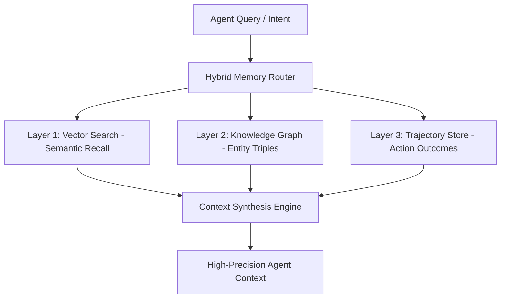

**TL;DR** — Standard vector-only RAG is hitting fundamental limits in production agentic systems. Dense embeddings are superb at finding similar passages, but fail when an agent needs to reason across multi-hop entity relationships, track chronological decision histories, or resolve contradictory updates. The production architecture for 2026 unifies three complementary layers: **Dense Vector Search** (semantic recall), **Knowledge Graph Triples** (explicit relational truth), and **Trajectory Learning** (memory of past actions and tool outcomes).

---

## Why does vector-only RAG fail for autonomous agents?

When building autonomous agents that execute multi-step plans across codebases and knowledge bases, standard vector similarity search introduces three critical failure modes:

1. **The Multi-Hop Blindspot**: An agent asked *"Why did we change the authentication policy after the July security audit?"* fails with naive vector search because the security audit, the policy change, and the rationale exist in separate chunks with low cosine similarity.
2. **Temporal Smearing**: When a codebase evolves from v1 to v3, vector databases return conflicting snippets from old and new documentation because both share similar vocabulary.
3. **Loss of Relational Structure**: Vectors capture semantic proximity, not directional causality. They cannot represent that *Service A depends on Database B which is governed by Policy C*.

To solve this, modern agentic systems employ a hybrid memory fabric combining vectors, knowledge graphs, and execution trajectories.

---

## What is the 3-layer persistent memory architecture?



### Layer 1 — Dense Vector Search (Semantic Retrieval)
- **Engine**: HNSW indexing over quantized vector embeddings (e.g., AgentDB or pgvector).
- **Purpose**: Rapid fuzzy matching, discovery of relevant unstructured text, and thematic clustering.
- **Strength**: High recall across broad conceptual queries.

### Layer 2 — Knowledge Graph Triples (Relational Grounding)
- **Engine**: Graph stores (e.g., Neo4j, FalkorDB, or embedded graph SQLite structures) storing `(Subject)-[Predicate]->(Object)` triples.
- **Purpose**: Explicit relational navigation, dependency mapping, and deterministic hierarchy resolution.
- **Strength**: Zero hallucination on entity relationships and causal pathways.

### Layer 3 — Trajectory Learning (Episodic Experience)
- **Engine**: Append-only execution logs capturing `(Goal, Context, Action, ToolCall, Outcome, Reward)`.
- **Purpose**: Learning from past mistakes, caching verified tool execution paths, and accelerating future runs.
- **Strength**: Prevents agents from repeating failed actions or re-exploring dead ends.

---

## How do you implement hybrid graph-vector retrieval in code?

Below is a production-grade TypeScript interface illustrating how the hybrid retrieval engine synthesizes vector similarity with graph traversal:

```typescript
export interface GraphEntity {
  id: string;
  name: string;
  type: "concept" | "repository" | "policy" | "agent" | "decision";
  properties: Record<string, unknown>;
}

export interface GraphRelation {
  sourceId: string;
  targetId: string;
  relationType: "DEPENDS_ON" | "AUTHORED_BY" | "GOVERNED_BY" | "SUPERSEDES";
  timestamp: string;
}

export interface HybridMemoryResult {
  entities: GraphEntity[];
  relations: GraphRelation[];
  semanticSnippets: Array<{ content: string; score: number }>;
  historicalTrajectories: Array<{ action: string; success: boolean; notes: string }>;
}

export async function queryHybridMemory(
  query: string,
  vectorStore: { search: (q: string, k: number) => Promise<Array<{ text: string; score: number }>> },
  graphStore: { traverse: (seedEntities: string[]) => Promise<{ nodes: GraphEntity[]; edges: GraphRelation[] }> }
): Promise<HybridMemoryResult> {
  // Step 1: Semantic discovery
  const semanticMatches = await vectorStore.search(query, 5);
  
  // Step 2: Extract seed entity identifiers from top vector results
  const seedIds = semanticMatches.map(m => extractEntityId(m.text)).filter(Boolean);
  
  // Step 3: Traverse 2-hop relational neighborhood in knowledge graph
  const { nodes, edges } = await graphStore.traverse(seedIds);
  
  return {
    entities: nodes,
    relations: edges,
    semanticSnippets: semanticMatches.map(m => ({ content: m.text, score: m.score })),
    historicalTrajectories: []
  };
}

function extractEntityId(text: string): string {
  const match = text.match(/\[entity:([a-zA-Z0-9_-]+)\]/);
  return match ? match[1] : "";
}
```

---

## How does trajectory learning compound agent intelligence?

Every time an autonomous agent completes a multi-turn task (such as refactoring a module or debugging a deployment failure), the operational trail is normalized into a **trajectory unit**:

| Trajectory Field | Description | Production Example |
|---|---|---|
| `taskFingerprint` | Deterministic hash of intent and environment state | `sha256("deploy-observatory-next16")` |
| `actionsAttempted` | Ordered list of tool invocations and CLI commands | `["pnpm build", "check-links", "fix-css"]` |
| `terminalState` | Outcome status and verification assertions | `SUCCESS (all 17 tests passed)` |
| `distilledInsight` | Compact takeaway injected into future context | `"observatory Next.js 16 requires standalone output flag"` |

When a future subagent encounters a similar task fingerprint, it retrieves the distilled insight before making its first tool call, bypassing exploratory trial-and-error and cutting execution latency by up to 75%.

---

## What are the essential quality gates for memory management?

1. **Eviction Hygiene**: Purge or archive unreferenced memory nodes after 90 days of inactivity to prevent context window saturation.
2. **Supersession Rules**: When a new policy or architecture replaces an older one, mark the relationship as `SUPERSEDES` rather than deleting history, preserving audit trails.
3. **Cross-Tenant Isolation**: Store private credentials, customer identifiers, and sensitive API keys in encrypted local vaults, excluded from general embedding indexes.
4. **Anti-Slop Memory Validation**: Filter out conversational filler and ambiguous agent self-talk before committing records to the long-term knowledge graph.

---

## Internal Links & Further Reading

- [Persistent Memory Architecture for AI Agents](/blog/ai-agent-memory-persistent-systems) — Technical exploration of persistent state and memory tiers.
- [Multi-Agent Model Fabric 2026](/blog/multi-agent-model-fabric-2026-wave) — Multi-agent routing and handoff architectures.
- [The 4-Week Personal AI CoE Rebuild](/blog/4-week-personal-ai-coe-2026-rebuild) — Structuring your personal AI assets around durable files.
- [AEO Knowledge Graph 2026](/blog/aeo-knowledge-graph-2026) — Optimizing knowledge graphs for AI answer engines.
- [Production Agent Patterns & 7 Pillars](/blog/production-agent-patterns-7-pillars) — Core principles of enterprise agent engineering.

---

## FAQ

### What is Graph RAG and how does it differ from traditional RAG?
Graph RAG supplements vector retrieval with an explicit knowledge graph of entities and relationships. While traditional RAG retrieves isolated chunks based on textual similarity, Graph RAG traverses interconnected nodes to provide structured, multi-hop contextual answers.

### Why is Trajectory Learning critical for agent swarms?
Trajectory Learning records the step-by-step tool calls and outcomes of previous runs. This enables agents to learn from past failures, reuse verified execution strategies, and avoid repeating expensive exploratory mistakes.

### Can Graph RAG run entirely locally?
Yes. Embedded graph engines and local vector stores can run inside SQLite or local vector databases (such as AgentDB or DuckDB) on standard workstations, offering zero-cost, privacy-safe local memory.

### How do I prevent knowledge graphs from growing stale?
Implement explicit `SUPERSEDES` relationship edges and timestamp-based versioning. When new code or documentation is ingested, stale assertions are flagged and deprioritized during retrieval.

### What is the performance overhead of querying a hybrid memory system?
A well-indexed hybrid system executes vector queries in 5–15ms and graph neighborhood traversals in 2–8ms, resulting in sub-30ms total context retrieval time while drastically reducing downstream LLM token hallucination.
