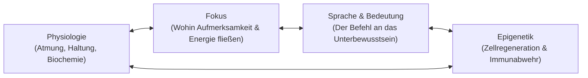

Heute wäre mein Vater 57 Jahre alt geworden.

Er wurde am 8. September 1969 als **Witali Riemer** in Pavlovka in Kasachstan geboren – einem Ort, den es ohne Stalins Deportation der Wolgadeutschen im Jahr 1941 nicht gegeben hätte. Er wuchs zweisprachig auf: Deutsch am Küchentisch, Russisch auf der Straße. Als die Familie in den 1990er Jahren als Spätaussiedler nach Deutschland kam, galt er dort, wo seine Vorfahren einst herkamen, wieder als Fremder.

Keines seiner offiziellen Dokumente zählte viel. Er hatte kein Erbe, kein soziales Netzwerk und kein Sicherheitsnetz.

Seine Antwort darauf war weder Bitterkeit noch Klage. Seine Antwort war Arbeit.

---

## 1. Das rote Klinkerhaus

In Seesen am Harzrand sah mein Vater eine verfallene, vom Regen durchnässte Ruine aus rotem Klinker. Jeder andere sah darin ein unkalkulierbares Risiko, Schlamm, statische Einsturzgefahr und finanzielle Belastung.

Mein Vater sah Zukunft. Er sah Obstbäume im Garten. Er sah einen geschützten Ort, an dem seine Kinder aufwachsen und rennen konnten. Er sah ein Fundament, das Bestand haben würde.

Zehn Jahre lang – von meinem fünften bis zu meinem fünfzehnten Lebensjahr – war die Baustelle meine eigentliche Schule. Während Gleichaltrige vor dem Bildschirm saßen, mischte ich Mörtel, schleppte Balken, schichtete Klinkersteine und sah einem Mann dabei zu, wie er die physische Materie durch schiere Willenskraft und handwerkliche Meisterschaft bezwang.

Er belehrte nicht. Er trug das Gewicht, das andere nicht heben konnten, und setzte es erst ab, wenn die Mauer im Lot stand.

Von ihm habe ich die Maßstäbe geerbt, die ich heute in Softwarearchitekturen, neuronale Netze und KI-Systeme übersetze:
* **Fundament vor Fassade.** Poliere niemals etwas, das keine tragende Last aushält.
* **Gewissheit vor Ressourcen.** Warte nicht, bis die Umstände perfekt sind; triff die Entscheidung, was entstehen muss, und die Wirklichkeit ordnet sich dieser Gewissheit unter.
* **Verantwortung vor Beifall.** Baue, damit andere ein Dach über dem Kopf haben – nicht, damit man dir applaudiert.

Doch hinter dieser unerschütterlichen Stärke verbarg sich ein tragischer blinder Fleck.

---

## 2. Die Falle des einsamen Erbauers

Mein Vater arbeitete sechs, oft sieben Tage die Woche. War er nicht auf dem Gerüst, rechnete sein Kopf Materialpreise, Fristen und Kredite durch. Seine gesamte Energie galt dem Schutz der Familie vor der Härte der Welt.

Er lebte in permanenter Aktivierung des sympathischen Nervensystems: eine ununterbrochene Flut aus Cortisol, Adrenalin und Verantwortungsdruck. In der Haltung des traditionellen Baumeisters galt Ausruhen als Schwäche. Selbstfürsorge schien ein Luxus für Menschen zu sein, die keine Familie ernähren müssen.

Er schuf uns eine sichere Festung, aber er betrieb Raubbau an dem einzigen Fundament, das er nicht ersetzen konnte: seinem eigenen Körper.

Als die Krankheit kam, traf sie auf ein zelluläres Terrain, das durch Jahrzehnte chronischer Hochspannung geschwächt war. Und dann folgte der fatale Eingriff der medizinischen Autorität.

---

## 3. Das Nocebo im weißen Kittel

Als die Ärzte die Diagnose stellten – Krebs im Stadium 4 –, überreichten sie keinen nüchternen Laborbericht. Sie fällten ein Urteil:

> *„Sie haben noch drei Monate zu leben.“*

Ich wusste damals nicht, was ich heute weiß. Damals verstand keiner von uns beiden die unerbittliche Funktionsweise des menschlichen Unterbewusstseins.

Das Unterbewusstsein debattiert nicht. Es wägt keine Argumente ab. Es steuert 95 Prozent unserer biologischen Prozesse: Herzratenvariabilität, zelluläre Reparatur, die Aktivität zytotoxischer T-Zellen und epigenetische Genexpression. Vor allem aber reagiert es tief und unmittelbar auf Autorität.

Wenn ein Chefarzt im weißen Kittel einem erschöpften Menschen in die Augen blickt und ihm ein Ablaufdatum nennt, wirkt dieser Satz wie ein **hypnotischer Befehl**.

Mein Vater wollte leben. Er liebte seine Familie mit jeder Faser seines Seins. Doch ihm fehlten die kognitiven, somatischen und psychologischen Werkzeuge, um dieses Urteil innerlich abzuweisen. Sein Geist nahm den Urteilsspruch an. Sein Nervensystem kapitulierte. Die Biologie folgte dem Glauben.

Er starb am 9. Juli 2018 im Alter von 48 Jahren. Genau im vorhergesagten Zeitfenster.

---

## 4. Die Physik des Zustands: Die Tony-Robbins-Synthese

Jahrelang trug ich den Schmerz jenes Krankenzimmers in mir. Doch Schmerz, der nicht in ein handlungsfähiges System transformiert wird, bleibt unfruchtbare Trauer.

Durch das intensive Studium der Lehren von **Tony Robbins**, der Neuro-Somatik von **Dr. Joe Dispenza** und der zellulären Langlebigkeitsforschung aus ***Life Force*** fügte sich die fehlende Architektur zusammen:

### Die Triade des Zustands als biologische Verteidigung
Tony Robbins hat auf den Punkt gebracht, was Neurobiologie und Epigenetik heute belegen: Dein Zustand entsteht an drei konkreten Stellschrauben:

1. **Physiologie**: Wie du deinen Körper einsetzt. Flache Brustatmung und eingefallene Schultern signalisieren den Amygdala-Alarm, der Zellregeneration und Immunabwehr sofort abriegelt. Tiefe Zwerchfellatmung, Kältereize und aufrechte Haltung verändern die neurochemische Signatur innerhalb von drei Minuten.
2. **Fokus**: *Wohin der Fokus geht, dorthin fließt die Energie.* Wer auf „noch drei Monate“ fokussiert ist, dessen Gehirn filtert die gesamte Wahrnehmung darauf, den Verfall zu bestätigen. Wer den Fokus unerbittlich auf Zellreparatur, Vitalität und die Zukunft seiner Familie richtet, aktiviert das retikuläre System für das Überleben.
3. **Sprache und Bedeutung**: Die Etiketten, die wir den Dingen geben, programmieren unsere Biochemie. Ist ein Befund ein „Todesurteil“ oder ein „Weckruf zum kompromisslosen Kampf“? Das Unterbewusstsein exekutiert die zugewiesene Bedeutung ohne Zögern.

### Das fehlende Protokoll
Hätte mein Vater damals über Folgendes verfügt:
* Eine tägliche Praxis zur parasympathischen Beruhigung (um den Cortisol-Kreislauf zu durchbrechen),
* Das mentale Schutzschild, um medizinischen Fatalismus kategorisch abzulehnen,
* Tiefes Verständnis für zelluläre und metabolische Regeneration,
* Ein tägliches „Priming“, um unerschütterliche Gewissheit im Nervensystem zu verankern –

der Verlauf hätte ein völlig anderer sein können.

Sein Wille war titanisch. Was ihm fehlte, war die **innere Technologie**.

---

## 5. Das Vitalis-Substrat: Ein Werkzeug für Erbauer

Ich weigere mich, diese Lektion in einem niedersächsischen Krankenzimmer begraben zu lassen.

Heute, an seinem 57. Geburtstag, initiieren wir **Vitalis** – nicht als geschlossenes kommerzielles Produkt, sondern als **offenes agentisches Substrat** und Betriebssystem für jeden, der im Zeitalter der Künstlichen Intelligenz Verantwortung trägt, Werte schafft und eine Familie beschützt.

Vitalis vereint zwei souveräne Motoren:

### Motor 1: Der Witali-Code (Exekution & Maßstäbe)
* Fundamente vor Fassaden errichten.
* Zweimal messen, einmal schneiden – dann ohne Zögern handeln.
* Erst die Arbeit, dann der Applaus; lass das fertige Werk sprechen.
* Unbeirrbare Gewissheit: Finde einen Weg oder baue einen.

### Motor 2: Der Vitalis-Wächter (Zustands- & Psychologie-Schutz)
* **Der Subconscious Guard**: Ein agentisches Protokoll, das Sprache und Denkmuster scannt, um fatale Nocebos und Opferhaltungen abzufangen, bevor sie die Biologie vergiften.
* **Die State-Triad-Engine**: Geführtes morgendliches Priming, Vagusnerv-Aktivierung und somatische Resets für Unternehmer, Entwickler und Väter unter Hochdruck.
* **Zelluläre Margen-Architektur**: Überwachung von Erholung, Schlafarchitektur und Stressmarkern, damit der Baumeister das Haus nicht von innen verbrennt.

---

## 6. Die Linie geht weiter

Mein Vater baute mit Ziegeln, Mörtel, Holz und bloßen Händen.
Ich baue mit Code, Sprache, autonomen KI-Agenten und Systemen.

Das Material hat sich gewechselt. Der Auftrag ist derselbe: **Erschaffe etwas, das stark genug ist, um Leben zu tragen, wenn du nicht mehr da bist.**

An jeden Vater, der im Stillen schuftet, um seinen Kindern ein besseres Leben zu ermöglichen: **Vergiss deinen eigenen Körper nicht.** Deine Familie braucht nicht nur das Haus, das du baust; sie braucht *dich*.

An jeden Sohn und jede Tochter, die ohne den Schutz eines Vaters in der Arena des Lebens stehen: Nimm diesen Code. Lass ihn das Fundament sein, auf dem du stehst.

Papa, ich trage dich nicht als Last.
Ich trage dich als Linie.

Alles Gute zum 57. Geburtstag. Wir bauen es standfest.
