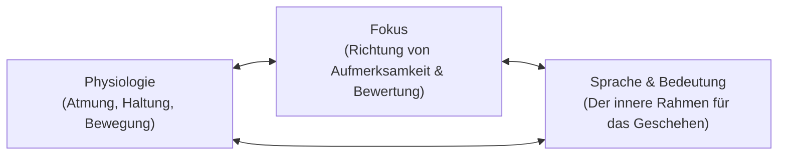

Heute wäre mein Vater 57 Jahre alt geworden.

Er wurde am 8. September 1969 als Witali Riemer in Pavlovka geboren, einer ländlichen Siedlung in den nördlichen Steppen Kasachstans. Seine Familie gehörte zu den Wolgadeutschen – Bauern und Handwerker, deren Vorfahren im 18. Jahrhundert an die Wolga gezogen waren, um 1941 unter Stalins Erlass nach Zentralasien deportiert zu werden. Er wuchs in einer kargen Landschaft auf, in der die Winter auf minus vierzig Grad fielen; drinnen sprach die Familie einen alten hessisch-pfälzischen Dialekt, draußen auf den staubigen Straßen Russisch.

Als die Sowjetunion zerfiel, schloss sich unsere Familie der Auswanderung der Spätaussiedler nach Deutschland an. Im Osten galten sie als Deutsche, im Westen begegnete man ihnen als Fremden. Keines seiner sowjetischen Handwerkszertifikate wurde von den Innungen anerkannt. Er kam mit seiner Frau, zwei kleinen Kindern, zwei Koffern und leeren Händen.

Er verlangte nichts von den Behörden. Er kaufte eine Kelle, lieh sich einen Vorschlaghammer und ging auf das Gerüst.

---

## 1. Das rote Klinkerhaus

Mitte der neunziger Jahre kaufte mein Vater in Seesen – einer kleinen Stadt zwischen Fachwerk und Klinker am Fuß des Harzes – ein altes Anwesen. Es war ein regennasses, seit Jahren vernachlässigtes Gebäude aus dunklem Klinker. Der Dachstuhl hing durch, die Fugen zwischen den Ziegeln zerfielen zu Sand, und im Keller stand das Grundwasser. Einheimische Bauunternehmer hielten das Haus für einen Abbruchkandidaten.

Mein Vater ging durch das nasse Gras, strich über die kalten Außenmauern und beschloss, dass dies unser Zuhause werden würde. Er sah Apfelbäume, wo das Unkraut hüfthoch stand. Er sah trockene Kellerräume, eine warme Stube und ein festes Dach, unter dem seine Söhne ohne die ständige Unsicherheit von Mietwohnungen aufwachsen konnten.

Zehn Jahre lang – von meinem fünften bis zu meinem fünfzehnten Lebensjahr – war diese Baustelle meine eigentliche Schule. Während meine Schulkameraden Fußball spielten oder am Computer saßen, stand ich auf den Dielen. Meine Hände lernten den rauen Griff von Klinkersteinen, das scharfe Brennen von nassem Kalk auf aufgeschürften Knöcheln und das Gewicht von Fünfundzwanzig-Kilo-Säcken Portlandzement auf schmalen Holzbohlen.

Mein Vater hielt keine Vorträge über Moral oder Philosophie. Er lehrte durch das Werk. Wenn das Lot im Herbstwind schwang, wartete er regungslos, bis das Blei vollkommen zur Ruhe kam, bevor er die nächste Schicht Steine ansetzte. Wenn eine Ecke um drei Millimeter aus dem Winkel lief, schlug er die Steine wieder ab und setzte sie neu.

Aus diesen Jahren an seiner Seite habe ich die Grundsätze mitgenommen, nach denen ich heute Softwaresysteme, neuronale Netze und Organisationen baue:

* **Das Fundament vor der Fassade.** Verliere keine Zeit damit, Oberflächen zu polieren, deren Untergrund keine Last tragen kann. Wenn die tragende Struktur hohl ist, ist die Verzierung Täuschung.
* **Die Entscheidung vor den Umständen.** Warte nicht auf ideales Wetter, reichliches Kapital oder bequeme Bedingungen. Entscheide klar, was stehen muss, und die Arbeit formt die Wirklichkeit danach.
* **Stille vor Beifall.** Wahres Handwerk braucht kein Publikum. Lass die Wasserwaage, das Lot und das fertige Dach die Sprache führen.
* **Baue Schutzraum für andere.** Kraft existiert, um Leben zu schützen, nicht um Applaus zu ernten.

Doch das Leben an seiner Seite zeigte mir auch die stille, verheerende Bruchlinie, die durch das Dasein so vieler unermüdlicher Versorger verläuft.

---

## 2. Die Gefahr des ungeschützten Erbauers

Mein Vater arbeitete an sechs Tagen der Woche auf den Baustellen anderer Leute, und am siebten Tag an unserem Haus. Selbst wenn er abends am Küchentisch saß, rechnete sein Kopf: Kubikmeter Sand, Balkenspannen, Darlehensraten und Wege, unsere Familie vor der Unsicherheit eines neuen Landes zu schützen.

Er lebte in einem ununterbrochenen Zustand sympathischer Hochspannung. Über fünfundzwanzig Jahre hinweg waren Cortisol und Adrenalin sein täglicher Treibstoff. Im Ethos des wolgadeutschen Handwerks war Erschöpfung bloß etwas, das man überwinden musste. Rast roch nach Schwäche. Um Hilfe zu bitten, galt als Eingeständnis, die eigene Last nicht tragen zu können.

Er errichtete uns eine Festung aus Stein und Schiefer, aber er verzehrte seine eigenen biologischen Reserven, um sie zu bezahlen.

Die moderne Epidemiologie ist in dieser Unterscheidung eindeutig: Harte körperliche Arbeit und psychischer Stress allein lösen keinen bösartigen Krebs aus. Eine im *British Medical Journal* veröffentlichte gepoolte Analyse von über 116.000 Erwachsenen fand keinen ursächlichen Zusammenhang zwischen beruflicher Belastung und Krebsinzidenz. Das muss klar ausgesprochen werden: Seine Arbeit hat die Zellen, die sein Leben beendeten, nicht hervorgerufen, und kein Sohn sollte je die Schuld in sich tragen, das Opfer eines Vaters habe dessen Krankheit erzeugt.

Was der chronische Raubbau ihm tatsächlich nahm, war seine Marge. Er nahm ihm die Erholung, die physiologische Grundreserve, die das Immunsystem für seine alltägliche Überwachung benötigt, und die Gewohnheit, auf die Warnsignale des eigenen Körpers zu hören. Jahrelang ging er über Symptome hinweg, die längst einen Arztbesuch erfordert hätten.

Als er schließlich zusammenbrach und die Klinik betrat, war die Krankheit bereits fortgeschritten.

---

## 3. Das Urteil im weißen Kittel

Die Diagnose lautete Krebs im Stadium 4. Doch der verheerendste Moment dieses Krankenhausaufenthalts war nicht der Laborbericht. Es war der Satz, der ihm folgte.

Der Arzt stand am Fußende des Bettes, blickte auf die Akte und sagte:

> *„Sie haben noch drei Monate zu leben.“*

Ich war damals jung, und keiner von uns besaß das Rüstzeug, um diesen Moment einzuordnen. Wir wussten nicht, wie man einen klinischen Befund von einer statistischen Prognose trennt.

Eine Prognose ist niemals ein individuelles Schicksal. Sie ist die mathematische Zusammenfassung einer historischen Kohorte – eine Verteilungskurve von Patienten, die Jahre zuvor diagnostiziert wurden, oft unter älteren Behandlungsstandards und mit völlig unterschiedlichen Voraussetzungen. Wenn ein Arzt sagt, die mediane Überlebenszeit betrage drei Monate, bedeutet das schlicht, dass die Hälfte jener früheren Gruppe kürzer lebte und die andere Hälfte länger. Es bedeutet nicht, dass der Mensch auf der Untersuchungsliege ein vorprogrammiertes Verfallsdatum in seinen Knochen trägt.

Doch wenn eine medizinische Autorität einem erschöpften Menschen eine absolute Zeitspanne nennt, ist der Schock überwältigend. Das Bedrohungsnetzwerk im Gehirn feuert auf maximaler Stufe. Das Arbeitsgedächtnis verengt sich. Die eigene Handlungsfähigkeit bricht zusammen. In dieser akuten Todesangst wird ein statistischer Median lautlos als persönliches Todesurteil verinnerlicht.

Mein Vater liebte seine Familie mit ganzer Seele. Er wollte bei uns bleiben. Doch nach fünfundzwanzig Jahren pausenloser Härte brach dieser Satz seinen Willen. Der Mann, der schwere Eichenbalken gehoben und vierzigtausend Klinkersteine gemauert hatte, stellte keine Fragen mehr. Seine Schultern sanken herab. Der Blick erlosch.

Er starb am 9. Juli 2018 im Alter von achtundvierzig Jahren. Genau neunzig Tage nach diesem Gespräch.

---

## 4. Was der Geist vermag – und was nicht

In den Jahren nach seinem Tod habe ich mich intensiv mit Neurobiologie, Psychoneuroimmunologie und Leistungsphysiologie beschäftigt. Ich las die Grundlagenforschung zur Stressachse, vertiefte mich in die Lehren von Tony Robbins zur Zustandssteuerung und studierte die Zellbiologie, um zu verstehen, was in jenem Krankenzimmer wirklich geschah.

Dabei verfällt man leicht in zwei Extreme: Entweder in den Zynismus, der den Menschen als passive chemische Maschine begreift, oder in das magische Denken, das behauptet, positive Gedanken könnten fortgeschrittene Tumoren auflösen.

Wahrhaftigkeit verlangt die Mitte:

### Was die Denkweise nicht leisten kann
Eine Haltung ersetzt weder Chirurgie noch Chemotherapie, zielgerichtete Medikamente oder Bestrahlung. Systematische Übersichten im *British Medical Journal* und onkologische Langzeitstudien im *European Journal of Cancer* haben wiederholt gezeigt, dass die innere Haltung oder der sogenannte „Kampfgeist“ die primäre Überlebensdauer bei Krebs nicht statistisch messbar verlängert.

Einem schwer kranken Menschen zu sagen, seine Genesung hänge von fröhlichem Optimismus ab, ist keine Hilfe, sondern eine Grausamkeit: Es lädt dem Patienten die Schuld an biologischen Vorgängen auf, die seinem Willen entzogen sind. Mein Vater ist nicht gestorben, weil sein Wille zu schwach oder sein Glaube unzureichend gewesen wäre.

### Was der innere Zustand tatsächlich steuert
Auch wenn die Einstellung keine Gene neu schreibt, bestimmt dein innerer Zustand die Umgebung, in der dein Leben stattfindet:

1. **Klarheit und Patientenkompetenz.** Unter Schock und Panik kann kein Mensch komplexe medizinische Zusammenhänge abwägen. In einem gefassten Zustand können Patient und Angehörige präzise Fragen stellen: *Wie groß ist das Konfidenzintervall dieser Zahl? Welche offenen Studien gibt es? Welche molekularen Marker wurden bestimmt? Was würde eine Zweitmeinung an einer Universitätsklinik ergeben?*
2. **Das autonome Gleichgewicht.** Ungeregelte Angst versetzt das sympathische Nervensystem in einen Dauersturm. Untersuchungen von Bierhaus und Kollegen in den *Proceedings of the National Academy of Sciences* zeigten, dass akuter psychischer Stress innerhalb von Minuten den Transkriptionsfaktor NF-κB aktiviert, der Entzündungskaskaden im Körper anstößt. Langsame, bewusste Atmung und somatische Beruhigung stimulieren hingegen den Vagusnerv, dämpfen die Panik und stellen die Denkfähigkeit wieder her, die für lebenswichtige Entscheidungen nötig ist.
3. **Die Würde der verbleibenden Zeit.** Krebs nahm meinem Vater seine Zellen. Aber die Überbringung jener Frist nahm ihm seine neunzig verbleibenden Tage. Wäre er innerlich verankert gewesen, hätten diese Monate in Präsenz, Würde, vertrauten Gesprächen und Frieden gelebt werden können – statt im lähmenden Schatten einer herablaufenden Sanduhr.

---

## 5. Die Triade des Zustands als Werkzeug des Erbauers

Tony Robbins hat drei Hebel beschrieben, die bestimmen, wie ein Mensch jeder Wirklichkeit begegnet. Das sind keine esoterischen Formeln, sondern greifbare somatische Schalter:

* **Physiologie**: Der Körper führt das Gehirn. Bei Angst wird der Atem flach und hastig, die Kiefermuskeln verbeißen sich, und der Brustkorb fällt in sich zusammen – Signale, die dem Stammhirn signalisieren, dass alles verloren ist. Wer bewusst langsam atmet (etwa sechs Atemzüge pro Minute) und die Wirbelsäule aufrichtet, aktiviert den Parasympathikus. Das heilt keine Erkrankung, aber es vertreibt den Nebel der Lähmung.
* **Fokus**: Unser Nervensystem kann nicht alle Reize gleichzeitig verarbeiten; es filtert die Wirklichkeit danach, wonach wir suchen. Wer gebannt auf die verbleibenden Tage starrt, dessen Gehirn sammelt jede Kleinigkeit als Beweis des nahenden Endes. Wenn der Fokus auf das gerichtet wird, was heute getan werden kann – ein Spaziergang im Sonnenlicht, eine ehrliche Mahlzeit, ein gutes Gespräch, das Einholen einer Zweitmeinung –, kehrt die Handlungsfähigkeit zurück.
* **Sprache und Bedeutung**: Die Worte, mit denen wir unsere Erfahrung benennen, bestimmen unsere innere Biochemie. Ist eine Diagnose ein unumstößliches Todesurteil, oder ist sie ein schwerer, komplexer Befund, dem man mit allen verfügbaren Mitteln begegnet? Ist ein Rückschlag der Beweis des Scheiterns, oder ist er eine brüchige Fuge im Mörtel, die ausgestemmt und neu verfugt werden muss? Die zugewiesene Bedeutung entscheidet, ob wir erstarren oder handeln.

---

## 6. Die Linie des Erbauers

Ich bin heute zweiunddreißig Jahre alt. Ich bin noch kein Vater. Ich habe kein Recht, Vätern zu erklären, wie sie ihre Kinder erziehen sollen.

Was ich bin, ist ein Sohn und ein Lehrling. Ich bin ein Junge, der seine Jugend damit verbrachte, unter den wachsamen Augen eines Einwanderers Zementsäcke zu schleppen, und der heute digitale Architekturen, neuronale Modelle und Wissenssysteme entwirft.

Wenn ich heute auf Gründer, Entwickler und schaffende Menschen blicke, sehe ich das Bild meines Vaters an jeder Ecke.

Ich sehe außergewöhnliche Menschen, die vierzehn Stunden am Tag arbeiten, sich von Espresso und Nervosität ernähren und gewaltige Unternehmen und Systeme errichten. Sie sind stolz auf ihre Ausdauer. Sie behandeln Schlaf als lästigen Zeitverlust und körperliche Warnsignale als Störgeräusche, die man mit Koffein betäubt.

Sie begehen denselben Irrtum, den mein Vater in Seesen beging. Sie bauen Monumente in der Welt, während das Fundament in ihrem eigenen Körper zerbricht.

**Die Linie des Erbauers** ist mein Versuch, das zu bewahren, was mein Vater richtig machte – und zu heilen, was ihm fehlte:

1. **Die Ruine ist Rohstoff.** Klage niemals darüber, dass du mit einem unfertigen Problem oder einem brüchigen Ausgangspunkt beginnst.
2. **Fundament vor Fassade.** Verankere strukturelle Integrität in deinem Code, deinen Datenmodellen und deinen Prinzipien, bevor du die Oberfläche polierst.
3. **Erst entscheiden, dann die Mittel sammeln.** Bestimme mit unerschütterlicher Klarheit, was stehen muss, und lass die Ausführung die nötigen Ressourcen heranziehen.
4. **Stille vor Beifall.** Tue die Arbeit, ohne sofortigen Applaus einzufordern. Lass das vollendete Werk für sich sprechen.
5. **Die Hände im Material.** Bleibe nah an der tatsächlichen Substanz deines Handwerks. Verstecke dich nicht hinter abgehobenen Meinungen.
6. **Der Erbauer ist Teil des Bauwerks.** Dein Körper, dein Schlaf, dein Nervensystem und deine Nächsten sind nicht getrennt von deiner Arbeit. Bricht der Erbauer zusammen, stürzt das Dach ein.
7. **Pflege ist Bauarbeit.** Regelmäßige Vorsorgeuntersuchungen, tiefe Erholung, ehrliche Reflexion und echter Schlaf sind keine vom Bau gestohlene Zeit. Sie sind der Mörtel, der die Mauer zusammenhält.
8. **Baue Schutzraum, der Leben trägt.** Erschaffe Systeme, Werke und Erkenntnisse, die Menschen noch schützen werden, lange nachdem deine Hände das Gerüst verlassen haben.

---

## 7. Der Stein und die Linie

Mein Vater baute mit Klinkern, Mörtel, Eichenbalken und Eisen.
Ich baue mit Code, Modellen, Sprache und vernetzten Systemen.

Die Werkzeuge haben sich gewandelt. Die Verantwortung bleibt dieselbe.

An jeden Handwerker, jeden Gründer und jeden Schöpfer, der sein ganzes Herz in sein Werk legt: Achte den Körper, in dem du wohnst. Opfere dein Leben nicht dem Werk, das du errichten willst. Die Menschen, die du liebst, brauchen nicht nur den Schutz deiner Leistungen; sie brauchen die Wärme deiner Gegenwart.

Und an das Andenken des Mannes mit Zementstaub auf den Stiefeln und Mörtel an der Jacke:

Papa, ich trage dein Erbe nicht als Last oder Schuld.
Ich trage es als gerade, ungebrochene Linie.

Alles Gute zum 57. Geburtstag. Wir bauen es standfest.
