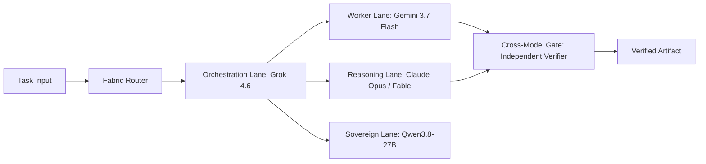

**TL;DR** — Relying on a single AI model across an entire business application creates severe single-point vulnerabilities, cost bloat, and context degradation. The modern production standard is the **Multi-Agent Model Fabric**: an interconnected, lane-based architecture where orchestrators, fast workers, deep reasoning engines, and sovereign local cells coordinate via typed handoff contracts and automated verification gates.

---

## What is a multi-agent model fabric?

A model fabric is the operational substrate that decouples your business logic from underlying AI model providers. Instead of hardcoding API calls directly to a specific LLM, the fabric routes tasks dynamically based on their computational shape, latency requirements, cost tolerance, and security constraints.



By decoupling execution into distinct lanes, you ensure that high-velocity generation runs at ultra-low cost while high-stakes reasoning receives maximum cognitive depth without cross-contaminating contexts.

---

## How are production execution lanes structured?

Every production swarm operates on four primary functional tiers:

| Lane Type | Primary Engine | Secondary / Fallback | Core Responsibilities | Evaluation Metric |
|---|---|---|---|---|
| **Orchestration & State (Queen)** | Grok 4.6 | Claude Opus 4.6 | Decomposing user goals, assigning subagent tasks, tracking multi-turn state, and validating execution milestones. | State consistency & tool-call precision |
| **High-Throughput Workers** | Gemini 3.7 Flash | DeepSeek-V4-Pro | Massively parallel file operations, code generation, summarization, and data extraction. | Tokens/sec & schema adherence |
| **Deep Reasoning & Architecture** | Claude Opus 4.8 / Fable | GPT-5.6 Sol | Red-teaming complex logic, resolving contradictory specifications, and crafting high-fidelity design artifacts. | Nuance & edge-case discovery |
| **Local Sovereign Cells** | Qwen3.8-27B | DeepSeek-R1-Distill | Air-gapped processing, confidential credential handling, and offline emergency failover. | Latency & zero-egress compliance |

---

## What makes handoff contracts enforceable in code?

In autonomous multi-agent systems, verbal instructions between agents degrade rapidly across multiple turns. Reliable fabrics enforce **typed mechanical handoff contracts**:

```typescript
export interface AgentHandoffContract<TOutput = unknown> {
  taskId: string;
  sourceAgent: string;
  targetAgent: string;
  payload: TOutput;
  schemaVersion: string;
  assertions: {
    passed: boolean;
    checks: string[];
  };
  telemetry: {
    model: string;
    tokenCount: number;
    latencyMs: number;
  };
}

export function validateHandoff<T>(
  contract: AgentHandoffContract<T>,
  schema: (data: unknown) => data is T
): boolean {
  if (!contract.assertions.passed) return false;
  if (!schema(contract.payload)) return false;
  if (contract.telemetry.tokenCount > 64000) return false;
  return true;
}
```

If a subagent produces output that violates the typed schema or fails any assertion check, the orchestrator instantly halts execution, logs the error, and re-routes the sub-task without propagating corrupted data downstream.

---

## How do automated evaluation layers operate?

Production fabrics implement three distinct evaluation tiers:

1. **Mechanical Assertions (Zero LLM Judges)**: Type-checking, JSON schema parsing, unit test execution, and static linting. These run in milliseconds and cost zero inference tokens.
2. **Blind Cross-Provider Evaluation**: When assessing qualitative output, a secondary model from an independent provider evaluates the artifact without seeing the original system prompt or model identity.
3. **Operational Telemetry Scoring**: Continuous monitoring of completion rates, retry counts, latency p95, and cost per successful delivery.

---

## How do cost ceilings and circuit breakers protect infrastructure?

High-throughput agent swarms can easily consume thousands of dollars in API credits if caught in an unconstrained retry loop. The fabric enforces strict defensive gates:

- **Per-Task Token Quotas**: Hard stop limits per subagent execution (e.g., maximum 32,000 output tokens per task).
- **Exponential Backoff with Circuit Breakers**: If three consecutive subagent calls fail schema validation, the lane trips open and alerts human operators.
- **Dynamic Cost-Based Degradation**: When daily API thresholds approach 85% of budget, non-critical background jobs automatically downgrade to open-weights local models.

---

## Internal Links & Further Reading

- [August 2026 Frontier Model Wave](/blog/august-2026-frontier-model-wave-routing) — Benchmarks and routing analysis for the latest frontier models.
- [Monday Operator Playbook](/blog/monday-operator-playbook-august-2026-models) — Step-by-step rollout schedule for multi-model swarms.
- [AI Model Routing Guide](/blog/ai-model-routing-guide) — Architectural guide to multi-provider routing.
- [Swarm Intelligence & Multi-Agent Orchestration](/blog/swarm-intelligence-multi-agent-orchestration) — Multi-agent coordination patterns.
- [Production Agentic AI Systems](/blog/production-agentic-ai-systems) — Enterprise blueprints for sovereign AI platforms.

---

## FAQ

### What is the primary benefit of a multi-agent model fabric?
A model fabric eliminates single-provider lock-in, reduces inference costs by 60–80% through smart tiering, and dramatically improves system reliability through independent verification gates.

### How does the fabric prevent infinite loops between subagents?
Fabrics utilize deterministic execution depth limits, per-task token ceilings, and circuit breakers that halt and escalate any recurring loop that fails validation across consecutive iterations.

### What is the role of local open-weights models in the fabric?
Local models like Qwen3.8-27B act as a zero-cost, air-gapped baseline for routine data transformation, classification, and uninterrupted operations during cloud provider outages.

### How does the Cross-Model Verification Gate work?
The Cross-Model Gate ensures that artifacts created by one model provider are reviewed and audited by a model from an entirely separate provider before being deployed or committed.

### Can I build a model fabric without complex infrastructure?
Yes. A model fabric begins with simple modular routing logic in your codebase, declaring explicit model assignments per task shape and wrapping tool calls in typed schema validation.