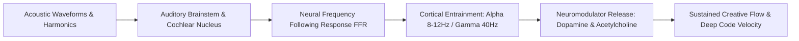

Sound is not merely aesthetic background noise; it is **biological software**. The human auditory pathway directly synapses into the brainstem, thalamus, and amygdala, bypassing the prefrontal cortex to modulate autonomic arousal, heart rate variability, and dopamine release within milliseconds of exposure.

In the FrankX creative stack, **Music Intelligence & Vibe Architecture** is a deliberate cognitive engineering discipline designed to induce sustained creative flow states.



---

## 1. The Neuroscience of Sonic Entrainment

The brain exhibits a natural physiological response termed the **Frequency Following Response (FFR)**. When rhythmic auditory stimuli are presented at specific intervals, cortical electroencephalogram (EEG) frequencies synchronize with the incoming beat:

- **Theta Waves (4–8 Hz)**: Associated with deep subconscious memory access, creative visualization, and associative ideation.
- **Alpha Waves (8–12 Hz)**: The bridge between conscious focus and calm relaxation; ideal for sustained reading and architectural design.
- **Gamma Waves (30–50 Hz / 40 Hz Peak)**: Associated with high-level cognitive binding, intense problem solving, and complex multi-file code synthesis.

```
Cognitive State Mapping:
Divergent Ideation  -> Theta / Alpha Coherence (6-10 Hz) -> Ambient cinematic textures, organic instruments
Deep Code Execution -> Alpha / Gamma Synchronization (10-40 Hz) -> Driving rhythmic synthwave, precise 120-128 BPM
```

---

## 2. Suno AI v4/v4.5 Architecture: Prompt Engineering for Sonic Precision

Modern diffusion-based audio generation models (such as Suno v4/v4.5) allow creators to architect bespoke soundscapes with surgical precision. Achieving studio-grade results requires structured acoustic prompt schemas:

```
┌─────────────────────────────────────────────────────────────┐
│                 SONIC PROMPT ARCHITECTURE                   │
├─────────────────────────────────────────────────────────────┤
│  GENRE & ERA     → Cinematic Cyberpunk Synthwave / Neo-Classical│
│  TEMPO & KEY     → 124 BPM, D minor, 432 Hz reference tuning│
│  INSTRUMENTATION → Moog bassline, Prophet-6 pads, live cello│
│  ACOUSTIC SPACE  → Massive cathedral reverb, wide stereo mix │
│  PRODUCTION      → Tape saturation, analog warmth, sidechain │
└─────────────────────────────────────────────────────────────┘
```

### Production Prompt Template

```
[Genre: Orchestral Cyber-Ambient]
[Tempo: 118 BPM, Key: F# Minor, Tuning: 432Hz]
[Instrumentation: Warm analog synth pads, sub-bass pulse, staccato violins, distant acoustic piano]
[Atmosphere: Nocturnal rain, deep reverb tail, binaural 40Hz gamma subtle pulse]
[Dynamic Arc: Slow atmospheric build -> focused rhythmic pulse -> soaring melodic resolve]
```

---

## 3. The Vibe OS Integration: Music as an Operating Layer

In the FrankX ecosystem, music is directly integrated into the developer and creator workflow:

1. **State-Change Rituals**: Initiating deep work sessions with specific musical overtures conditions the nervous system to drop into flow within 90 seconds.
2. **Context Anchoring**: Associating specific playlists or albums with specific projects prevents mental context switching fatigue.
3. **Harmonic Restoration**: Using 0.1 Hz resonant breathing paired with ambient frequency beds to rapidly down-regulate the nervous system after intense shipping sprints.

### Key Takeaways
- **Sound controls cortical rhythm**: Use sonic tempos and frequencies to deliberately shift between divergent brainstorming and high-velocity coding.
- **Precision prompting yields studio quality**: Structure generative music prompts with explicit musical keys, BPMs, and instrument profiles.
- **Music is cognitive infrastructure**: Treat your sonic environment with the same engineering rigor as your code editor and hardware setup.
