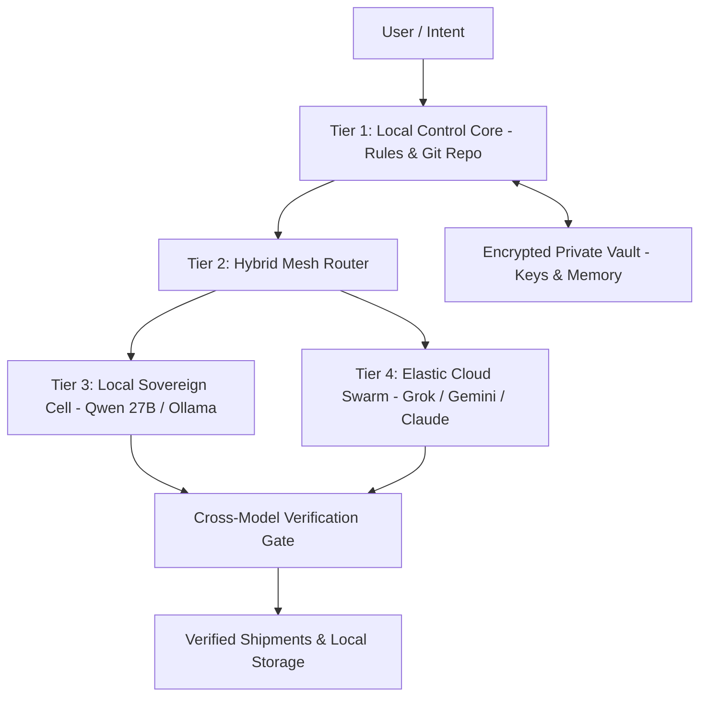

**TL;DR** — Relying exclusively on proprietary cloud AI platforms turns builders into fluent renters. When terms change, pricing shifts, or accounts are restricted, your entire operational capability evaporates. The solution is the **Sovereign AI Operating System**: an architectural design where local workstations own the ground truth (rules, memory, and code under version control), while cloud swarms act as disposable, high-performance execution accelerators governed by strict cost and privacy boundaries.

---

## What defines true AI sovereignty in 2026?

Sovereignty is not about isolating yourself from cloud compute; it is about **structural portability and asymmetric leverage**. An AI system is genuinely sovereign when:

1. **Your Core Assets Live on Disk**: Prompts, tool definitions, memory stores, and domain rules exist as plaintext files under Git version control, completely independent of any vendor's web UI.
2. **Your Eviction Price is Sub-One-Hour**: If any major AI API provider disappeared tonight, you could redirect your router to an alternative provider or local model in under sixty minutes with zero data loss.
3. **Sensitive Data Stays Air-Gapped**: Confidential credentials, customer personal data, and proprietary intellectual property never leave your local encrypted memory vaults.
4. **Local Execution Provides a Functional Floor**: Even during complete internet outages or severe API rate limits, local open-weight models handle indexing, draft creation, and code verification on your local hardware.

---

## What is the 4-tier Sovereign AI OS architecture?



### Tier 1 — Local Control Core (The Sovereign Plane)
- **Host**: Local developer workstation.
- **Components**: Git repository, Markdown/MDX knowledge base, local rulebooks, and typed execution contracts.
- **Responsibility**: System Single Source of Truth (SSOT). All decisions, logs, and outputs are committed locally.

### Tier 2 — Hybrid Mesh Router (The Dispatcher)
- **Host**: Local process or lightweight proxy daemon.
- **Components**: Cost monitors, latency evaluators, task-shape classifiers, and fallback handlers.
- **Responsibility**: Inspects task complexity and data sensitivity, then routes workloads to local models or elastic cloud endpoints.

### Tier 3 — Local Sovereign Cells (The Resilient Foundation)
- **Host**: Workstation GPU (e.g., 16GB–24GB VRAM) or Apple Silicon unified memory.
- **Components**: Open-weights engines (e.g., Qwen3.8-27B, DeepSeek-R1-Distill) via Ollama, llama.cpp, or vLLM.
- **Responsibility**: Zero-cost batch processing, continuous background file indexing, confidential analysis, and air-gapped tasks.

### Tier 4 — Elastic Cloud Swarms (The Velocity Multiplier)
- **Host**: Frontier cloud APIs (Grok 4.6, Gemini 3.7 Flash, Claude Opus 4.8).
- **Components**: Ephemeral worker pools executing parallel refactoring, web search synthesis, and heavy multi-repo reasoning.
- **Responsibility**: On-demand burst compute with strict token budgets and automated circuit breakers.

---

## How do you configure hybrid local-cloud routing in production?

Below is a clean configuration schema demonstrating how a sovereign AI OS routes tasks between local engines and cloud swarms:

```typescript
export interface SovereignRoutePolicy {
  taskCategory: "sensitive-data" | "routine-volume" | "complex-architecture" | "offline-fallback";
  targetEngine: "local-dense" | "cloud-high-speed" | "cloud-deep-reasoning";
  maxTokenBudget: number;
  dataClassification: "public" | "internal" | "confidential";
  fallbackEngine: "local-dense" | "none";
}

export const SOVEREIGN_ROUTER_POLICIES: Record<string, SovereignRoutePolicy> = {
  credentialAudit: {
    taskCategory: "sensitive-data",
    targetEngine: "local-dense",
    maxTokenBudget: 8000,
    dataClassification: "confidential",
    fallbackEngine: "none" // Never leak to cloud
  },
  batchFileTransformation: {
    taskCategory: "routine-volume",
    targetEngine: "cloud-high-speed", // e.g. Gemini 3.7 Flash
    maxTokenBudget: 64000,
    dataClassification: "internal",
    fallbackEngine: "local-dense"
  },
  systemArchitectureReview: {
    taskCategory: "complex-architecture",
    targetEngine: "cloud-deep-reasoning", // e.g. Claude Opus 4.8
    maxTokenBudget: 32000,
    dataClassification: "public",
    fallbackEngine: "local-dense"
  }
};
```

---

## How do private vaults protect credentials and identity?

In a sovereign architecture, third-party cloud models are treated as **untrusted execution environments**. The system applies three core security principles:

1. **Zero Raw Secret Exposure**: API keys, database credentials, and personal financial data are stored in local environment variables or encrypted Infisical vaults, never pasted into conversational prompts.
2. **Redaction Proxies**: Outbound payloads are scanned by a local regex and entropy auditor to strip sensitive patterns before cloud API transmission.
3. **Isolated Memory Compartments**: Private identity data and personal life logs remain in a dedicated local database, isolated from general swarm tool access.

---

## What are the 5 laws of sovereign AI operations?

| Law | Principle | Operational Enforcement |
|---|---|---|
| **I. Ground Truth on Disk** | Cloud state is ephemeral; local files are durable. | Every valid insight is written to local Markdown/JSON files and committed to Git. |
| **II. Maker ≠ Checker** | The model that generates an artifact must not be the sole auditor. | Mandatory cross-model verification gates with schema asserts. |
| **III. Bounded Expenditure** | No autonomous process may execute without token ceilings. | Hard circuit breakers trip after predefined retry limits. |
| **IV. Zero-Slop Standard** | High output volume must never compromise technical rigor. | Automated anti-slop linters and marketing claim audits run on every commit. |
| **V. Eviction Readiness** | Assume any cloud vendor could restrict access tomorrow. | Maintain active, tested local fallback models for all core tasks. |

---

## Internal Links & Further Reading

- [The 4-Week Personal AI CoE Rebuild](/blog/4-week-personal-ai-coe-2026-rebuild) — Restructuring your personal AI operations around durable local assets.
- [Multi-Agent Model Fabric 2026](/blog/multi-agent-model-fabric-2026-wave) — Building lane-based routing and handoff contracts.
- [Autonomous Knowledge Graphs & Graph RAG](/blog/autonomous-knowledge-graphs-rag-persistent-memory-2026) — Persistent memory fabrics for AI agents.
- [Best Local LLMs in 2026](/blog/best-local-llm-2026) — Choosing the right open-weights models for local inference.
- [Production Agentic AI Systems](/blog/production-agentic-ai-systems) — Enterprise blueprints for sovereign agent deployment.

---

## FAQ

### What is the difference between an AI tool and a Sovereign AI OS?
An AI tool is a third-party application where your data, memory, and prompts remain locked inside a proprietary web interface. A Sovereign AI OS is an owned codebase and file structure on your machine where models are modular plugins and you own the ground truth.

### Can a sovereign setup achieve the same speed as pure cloud workflows?
Yes. By using high-throughput cloud models (like Gemini 3.7 Flash) for non-sensitive heavy volume and local models for privacy and fallbacks, you achieve both maximum velocity and complete operational resilience.

### What minimum hardware is required to run a Sovereign AI OS?
A modern developer workstation with 16GB–32GB of RAM (or an Apple Silicon Mac with unified memory) can run quantized 8B–27B open-weights models locally while coordinating cloud swarms.

### How does git version control enhance AI sovereignty?
Storing prompts, skills, and memory in Git provides diff histories, rollback capabilities, and team collaboration without being dependent on a vendor's internal workspace management.

### How do I start migrating to a sovereign AI workflow today?
Begin by exporting your core prompts and standard instructions into Markdown files in a dedicated repository. Set up a simple routing file and test running routine tasks with a local model like Qwen3.8-27B.
