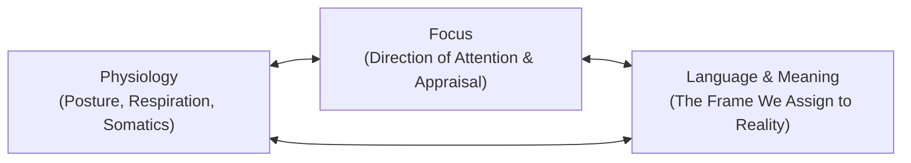

Today would have been my father’s 57th birthday.

He was born Witali Riemer on September 8, 1969, in Pavlovka, a rural settlement in the northern steppes of Kazakhstan. His family belonged to the Volga Germans—craftsmen and farmers whose ancestors had settled along the river in the eighteenth century, only to be deported eastward into Central Asia in 1941 under Stalin’s decree. He grew up in an austere landscape where winter temperatures dropped to minus forty, speaking an archaic dialect of German inside the house and Russian on the dusty streets outside. 

When the Soviet Union dissolved, our family joined the migration of *Spätaussiedler* moving to Germany. In the East, they had been viewed as Germans; in the West, they were received as foreigners. None of his Soviet trade credentials were recognized by the local guilds. He arrived with a wife, young children, two suitcases, and empty pockets. 

He asked for nothing from the state. He found a trowel, bought a used hammer, and went to work on the scaffolding.

---

## 1. The Red Clinker House

In the mid-1990s, in Seesen—a small timber and brick town resting at the foot of the Harz mountains—my father bought an abandoned property. It was an old house of dark red clinker brick, rain-soaked and long neglected. The roof had sagged, the mortar between the joints was turning to sand, and water had pooled in the cellars. Local contractors considered it an expensive liability fit only for demolition.

My father walked through the wet grass, touched the cold perimeter walls, and decided it would become our home. He planned apple trees where the weeds stood high. He imagined a dry cellar, a warm hearth, and sturdy rooms where his boys could grow up without the gnawing insecurity of rented walls.

For ten years—from the time I was five until I was fifteen—that construction site was my universe. While classmates played soccer or spent their afternoons with early computer games, I was on the site. My hands learned the rough bite of clinker stone, the sharp alkaline sting of wet lime on scraped knuckles, and the weight of twenty-five-kilogram sacks of Portland cement hauled up narrow timber planks. 

My father did not give lectures on character or philosophy. He taught through the work itself. When a plumb line swayed in the autumn wind, he waited until the lead weight came to absolute stillness before laying the next course of brick. If a corner was out of square by three millimeters, he took the wall down and laid it again.

From those years beside him, I absorbed the axioms that still govern how I design software systems, neural architectures, and organizations:

* **Foundation precedes facade.** You never spend time polishing surfaces that rest on unstable footings. If the load-bearing substrate is hollow, the ornament is a lie.
* **Commitment precedes conditions.** You do not wait for ideal weather, abundant capital, or convenient circumstances to begin. You choose what must stand, and the work shapes the reality around it.
* **Work in silence.** True craftsmanship requires no audience. You let the level, the plumb line, and the finished roof do the talking.
* **Build shelter for others.** Strength exists to protect life, not to win applause.

Yet watching him build also revealed the quiet, devastating fault line that runs beneath the lives of so many relentless providers.

---

## 2. The Danger of the Unshielded Builder

My father worked six days every week on the job sites, and the seventh day on our house. Even when he sat at the kitchen table in the evenings, his mind was calculating: cubic meters of sand, timber spans, loan installments, and how to shield our family from the volatility of an unfamiliar country.

He lived in an uninterrupted state of sympathetic arousal. For twenty-five years, cortisol and adrenaline were the fuel he ran on. In the ethos of the Volga-German craftsman, exhaustion was simply something to push past. Rest smelled of indulgence. Asking for help was perceived as an admission that a man could not shoulder his own burdens.

He built an enduring sanctuary of red brick and slate for us, but he spent down his own biological reserves to do it.

Modern epidemiology is clear on this distinction: hard physical work and psychological stress alone do not cause malignant cancer. A comprehensive pooled analysis of over 116,000 adults published in the *British Medical Journal* demonstrated no causal association between work stress and cancer incidence. It is vital to state that plainly: overwork did not trigger the cells that ended his life, and no son should ever harbor the guilt that a father's sacrifice caused his disease.

What chronic depletion actually stole was his margin. It stole the time to rest, the baseline physiological reserve that allows the immune system to patrol properly, and the habit of listening when the body signals that something is wrong. For years, he simply worked through warning signs that deserved a doctor's examination.

When he finally collapsed and entered the clinic, the disease had already spread.

---

## 3. The Sentence in the White Coat

The diagnosis was Stage 4 cancer. But the most dangerous moment of that hospital stay was not the delivery of the laboratory report. It was the sentence that followed it.

The physician stood at the foot of his bed, looked down at the chart, and said:

> *"You have three months to live."*

I was young then, and neither of us possessed the literacy to navigate that moment. We did not know how to separate a clinical finding from a statistical forecast.

A prognosis is never an individual prophecy. It is a mathematical summary of a historical cohort—a distribution curve drawn from patients who were diagnosed years earlier, often under older protocols and with varying health baselines. When a doctor states that median survival is three months, it means that half of that prior population lived shorter, and half lived longer. It does not mean the human being sitting on the examination table has a predetermined expiration date printed into their marrow.

Yet when clinical authority delivers an absolute timeline to an exhausted patient, the psychological impact is profound. The brain's threat circuitry fires at maximum intensity. Working memory contracts. Cognitive agency evaporates. In that state of acute terror, an abstract median is easily internalized as a personal verdict.

My father loved his family with an intensity that bordered on reverence. He did not want to leave us. But after twenty-five years of unrelenting physical strain, hearing that verdict shattered his resolve. The man who had lifted timber beams and laid forty thousand bricks stopped asking questions. His shoulders sank. The light in his eyes dimmed. 

He died on July 9, 2018, at the age of forty-eight. Exactly ninety days after the consultation.

---

## 4. What the Mind Controls, and What It Does Not

In the years following his death, I spent months studying neuroscience, psychoneuroimmunology, and the mechanics of human performance. I read the foundational literature on the stress response, explored the teachings of Tony Robbins on state management, and studied cellular biology to understand what actually occurred in that hospital room.

It is easy to swing between two dangerous extremes: the cynicism that treats human beings as passive chemical machines, or the magical thinking that promises positive thoughts can dissolve advanced tumors.

Integrity requires holding the truth in the middle:

### What the Mind Cannot Do
Mindset does not replace surgery, chemotherapy, targeted therapies, or radiation. Large-scale clinical evaluations—including systematic reviews published in the *British Medical Journal* and long-term oncology follow-ups in the *European Journal of Cancer*—have repeatedly shown that coping style or "fighting spirit" does not alter primary cancer survival rates. 

Telling a sick person that their recovery depends on maintaining cheerful thoughts is not empowerment; it is a cruelty that blames patients for biological processes beyond their conscious control. My father did not die because his will was weak or his thoughts were wrong.

### What the Mind Truly Governs
While attitude does not rewrite genetics, your internal state governs the operational environment of your life. It controls:

1. **Cognitive Clarity and Advocacy.** In acute panic, people cannot process complex data. In a regulated, sovereign state, a patient and their family can ask precise questions: *What is the confidence interval on that prognosis? What open clinical trials exist? What molecular markers were tested? What would a second opinion at an academic research center reveal?*
2. **The Autonomic Balance.** When fear runs unchecked, the sympathetic nervous system triggers widespread inflammatory signaling. Research by Bierhaus and colleagues in the *Proceedings of the National Academy of Sciences* demonstrated that acute psychological stress activates nuclear factor-kappa B (NF-κB) within minutes, driving inflammatory gene expression. Conversely, slow, conscious breathing and somatic regulation stimulate vagal nerve pathways, dampening panic and preserving the working memory needed to make critical medical choices.
3. **The Quality of the Time That Remains.** Cancer took my father’s cells. But the delivery of that three-month sentence took his ninety days. Had he been anchored in psychological sovereignty, those ninety days could have been lived in presence, dignity, shared stories, and deep peace, rather than in the paralyzing shadow of a ticking clock.

---

## 5. The State Triad as a Builder's Tool

In his work on human state, Tony Robbins identified three levers that determine how a human being meets any reality. These are not mystical concepts; they are accessible physical switches:

* **Physiology**: The body leads the brain. When anxiety strikes, breathing becomes shallow and rapid, the jaw tightens, and the chest collapses inward—signals that inform the brain that defeat is imminent. Taking slow, controlled breaths (approximately six breaths per minute) and aligning the spine immediately engages parasympathetic tone. It does not cure illness, but it clears the fog of terror.
* **Focus**: The human nervous system cannot process every sensory input simultaneously; it filters reality based on what we ask it to find. If attention is locked onto the terror of an expiration date, every ache and shadow confirms the end. When focus is redirected toward what is actionable today—a walk in the sun, a nutritious meal, a conversation with a son, a second opinion—agency returns.
* **Language and Meaning**: The labels we give our experiences dictate our neurochemistry. Is a diagnosis an eviction notice, or is it a complex challenge to be navigated with every tool available? Is a setback proof of failure, or is it a structural flaw in the mortar that needs repointing? The meaning you assign determines whether you act or surrender.

---

## 6. The Builder's Line

I am thirty-two years old today. I am not yet a father. I have no standing to tell fathers how to raise their children.

What I am is an apprentice. I am a son who spent his youth carrying stone under an immigrant builder's watchful eye, and who now spends his days building digital architectures, neural systems, and creative platforms.

When I look at modern founders, software engineers, and creators, I see my father's reflection everywhere. 

I see brilliant men and women working fourteen-hour days, subsisting on espresso and nervous energy, constructing extraordinary software, companies, and intellectual monuments for the world. They pride themselves on stamina. They treat sleep as an inefficiency and physical warning signs as noise to be muted with stimulants.

They are making the exact same error my father made in Seesen. They are building monuments on the outside while letting the builder within decay.

**The Builder's Line** is my attempt to preserve what my father got right, and to repair what he missed:

1. **The Ruin Is Raw Material.** Never lament beginning with a tangled problem or an imperfect foundation.
2. **Foundation Before Facade.** Build structural integrity into your code, your data models, and your principles before polishing the interface.
3. **Decide, Then Resource.** Decide with absolute clarity what must exist, and let execution gather the necessary means.
4. **Silence Before Crowds.** Do the work without demanding immediate recognition. Let the finished structure speak for itself.
5. **Hands in the Material.** Stay close to the actual substance of your craft. Do not hide behind abstract opinions.
6. **The Builder Is Part of the Structure.** Your body, your sleep, your nervous system, and your relationships are not things separate from your work. If the builder collapses, the roof falls in.
7. **Maintenance Is Construction.** Periodic medical screenings, deep rest, honest reflection, and genuine recovery are not time stolen from building. They are the mortar that keeps the wall standing.
8. **Build Shelter That Carries Life.** Construct systems, assets, and knowledge that will shelter people long after your hands have left the site.

---

## 7. The Stone and the Line

My father worked with clinker brick, mortar, oak beams, and steel. 
I work with code, models, prose, and distributed intelligence.

The tools are different. The responsibility is identical.

To every craftsman, founder, and creator pouring their soul into their work: respect the temple you inhabit. Do not sacrifice your life to the thing you are building. Your people do not just need the shelter of your achievements; they need the warmth of your presence.

And to the memory of the man with mortar on his boots and dust on his jacket:

Papa, I do not carry your sacrifice as a burden or a debt. 
I carry it as a straight, unbroken line.

Happy 57th birthday. We are building it true.
