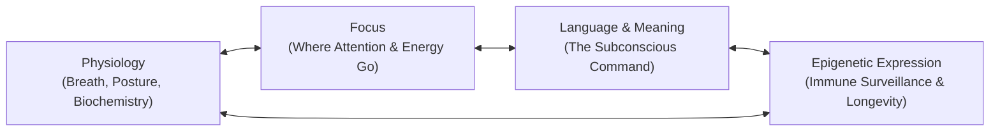

Today would have been my father’s 57th birthday.

He was born **Witali Riemer** on September 8, 1969, in Pavlovka, Kazakhstan—a settlement shaped by the 1941 Stalin deportation of Volga Germans (*Wolgadeutsche*). He grew up speaking German at home and Russian in the street, belonging to a people who were viewed with suspicion in the East and treated as foreigners when they finally returned to the West as *Spätaussiedler*.

When he arrived in Germany, none of his official papers carried weight. He had no safety net, no inheritance, and no social capital. 

His response was not grievance. His response was work.

---

## 1. The Red Klinker House

In Seesen, at the edge of the Harz mountains, my father looked at a neglected, rain-soaked ruin of red klinker brick that everyone else deemed an expensive liability. 

Where others saw mud, structural danger, and financial ruin, he saw a sanctuary. He saw fruit trees. He saw gardens where his children could run. He saw a foundation that would outlast him.

For ten years—from the time I was five until I was fifteen—the construction site was my school. While other kids were playing video games, I was mixing mortar, carrying beams, stacking red bricks, and watching a man bend physical matter to his will through pure focus. 

He didn't teach through lectures. He taught by lifting what was too heavy to carry and refusing to put it down until the wall was true.

From him, I inherited the standard I bring to software, neural architectures, and media today:
* **Foundation before facade.** Never polish what cannot bear structural load.
* **Certainty before resource.** You do not wait for conditions to be perfect; you decide what must exist, and reality reorganizes around that decision.
* **Stewardship over performance.** You build so that others have a roof over their heads, not so people applaud your effort.

Yet beneath that monumental strength lay a fatal blindspot.

---

## 2. The Trap of the Lone Builder

My father worked six, sometimes seven days a week. When he wasn't on the site, his mind was calculating materials, debts, timelines, and how to shield our family from the volatility of the world. 

He lived in permanent sympathetic nervous system activation—an uninterrupted flood of cortisol, adrenaline, and responsibility. In the worldview of the traditional craftsman, stopping to rest was perceived as weakness. Self-care was an indulgence for people who didn't have mouths to feed.

He gave us shelter, but he starved his own biological engine.

When disease knocked, his cellular terrain had been exhausted by decades of chronic tension. And then came the catastrophic intervention of modern clinical authority.

---

## 3. The White-Coat Nocebo

When the doctors delivered the diagnosis—Stage 4 cancer—they did not merely give a biochemical report. They delivered a verdict:

> *"You have three months to live."*

I did not know then what I know today. Back then, neither of us understood the terrifying physics of the subconscious mind.

The subconscious mind does not debate. It does not analyze logic. It regulates 95% of human physiology: heart rate variability, immune surveillance, cytotoxic T-cell activity, and genetic transcription. And above all, it is profoundly susceptible to authority.

When a physician in a white coat looks into the eyes of an exhausted man and gives him an expiration date, that statement functions as a **hypnotic command**. 

My father did not want to die. He loved his family fiercely. But he lacked the cognitive, somatic, and psychological tools to reject the prognosis. His mind absorbed the decree. His nervous system conceded the battle. His biology followed his belief. 

He died on July 9, 2018, at the age of 48. Exactly on schedule.

---

## 4. The Biology of Belief & The Tony Robbins Synthesis

For years, I carried the grief of that room. But grief that is not transformed into an operating system is wasted pain.

Over the past decade, delving deeply into the teachings of **Tony Robbins**, the neuro-somatic epigenetics of **Dr. Joe Dispenza**, and the cellular longevity research behind ***Life Force***, the missing architecture became undeniable.

The human being is an integrated cybernetic loop:

### The Triad of State as Biological Defense
Tony Robbins codified what ancient traditions and modern neuroscience both confirm: your state is determined by three controllable levers:

1. **Physiology**: How you use your physical vessel. Shallow chest breathing and slumped shoulders signal emergency to the amygdala, shutting down cellular repair. Deep, rhythmic diaphragmatic breathwork, cold exposure, and deliberate posture alter neurochemistry within 180 seconds.
2. **Focus**: *Where focus goes, energy flows.* If your focus is locked onto "three months to live," your brain filters every sensory input to validate decay. If your focus is locked onto cellular regeneration, vitality, and your children's future, the reticular activating system searches for life.
3. **Language and Meaning**: The labels you assign to events dictate your neurochemistry. Is a diagnosis a "death sentence" or a "call to war"? Is stress a "burden" or "fuel for building"? The subconscious executes whatever meaning you assign.

### The Fatal Missing Protocol
Had my father been equipped with:
* Daily parasympathetic down-regulation (breaking the cortisol loop),
* The cognitive armor to reject statistical medical fatalism,
* Deep metabolic and cellular awareness (mitochondrial health, anti-inflammatory nutrition),
* A daily priming practice to anchor certainty in his nervous system,

the trajectory could have been profoundly different. 

He had the willpower of a titan. What he lacked was the **internal technology**.

---

## 5. The Vitalis Substrate: A Gift to Builders

I refuse to let that lesson die in a hospital room in Lower Saxony.

Today, on his 57th birthday, we launch **Vitalis**—not as a closed commercial product, but as an **open agentic substrate** and operating system for anyone striving, building, or raising a family in the AI age.

Vitalis bridges two sovereign engines:

### Engine 1: The Witali Code (Execution & Standards)
* Build foundations before facades.
* Measure twice, cut once; commit completely.
* Work before applause; let the finished structure speak.
* Unwavering certainty: find a way or make one.

### Engine 2: The Vitality Sentinel (State & Mindset Protection)
* **The Subconscious Guard**: An autonomous agent protocol that scans your language and thoughts, intercepting fatalistic narratives and nocebos before they program your biology.
* **The State Triad Engine**: Guided morning priming, vagal nerve activation, and somatic resets designed for high-stress founders and creators.
* **Cellular Margin Architecture**: Tracking sleep, nervous system recovery, and metabolic signals so the builder never burns the house down from the inside.

---

## 6. The Line Continues

My father built with brick, mortar, concrete, and timber. 
I build with code, language, autonomous intelligence, and systems.

The medium has changed. The mandate has not: **build something strong enough to carry life after you are gone.**

To every father who is grinding in silence to give his children a better horizon: **do not forget the vessel.** Your family does not just need what you build; they need *you*.

To every son or daughter standing in the arena without a father's guidance: take this code. Let it be the foundation you stand upon.

Papa, I do not carry you as pressure. 
I carry you as a line.

Happy 57th birthday. We are building it right.
