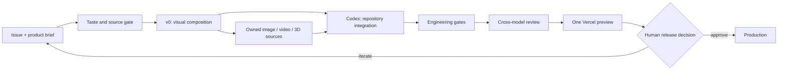

# FrankX v0 Template OS

Status snapshot: 2026-07-22.

This directory is the source of truth for the FrankX v0 catalog, first-party template packages, architecture teardowns, preview policy, and release evidence. It separates three things that must not be conflated:

1. FrankX first-party implementations.
2. Outbound references observed in the v0 community gallery.
3. Vercel marketplace templates owned by their publishers.

A v0 gallery listing is not proof that its author is Vercel or that FrankX may redistribute its source.

## Canonical Routes

| Route | Contract |
| --- | --- |
| `/v0` | Catalog, source policy, first-party packages, and operating model |
| `/v0/templates/[slug]` | Stable package detail, architecture, release boundaries, and optional preview |
| `/v0/studio` | Visual Foundry interactive prototype |
| `/design-lab/v0` | Legacy experiment archive; migrate separately after approval |
| `/ai-architecture` | Separate product surface; not part of this lane |

Do not create aliases such as `/v` or `/vercel`.

## Working Model

### v0 owns

- Page composition and component topology.
- High-value interaction concepts and responsive states.
- Bounded prototypes for visual tools, dashboards, editors, and product surfaces.
- Design-system application when a current brand pack and page brief are supplied.

### Codex owns

- Canonical repository integration and route architecture.
- Backend, data models, secrets, auth, billing, webhooks, persistence, queues, and observability.
- Security, accessibility, performance, tests, release evidence, GitHub issues, branches, PRs, and Vercel verification.
- Rewriting prototype code when it conflicts with the current taste kernel or stack.

### Claude owns

- Architecture critique, product judgment, copy review, and merge/kill recommendations.
- It does not write into the active Codex lane.

### Grok or another provider owns

- Adversarial verification, current-market challenge, and factual/source checks.
- Maker and checker must be different providers for consequential release output.

## When to Call v0 MCP

Call v0 when at least one is true:

- A new surface needs meaningful composition exploration.
- Interaction topology is unclear.
- Desktop and mobile states need to be designed together.
- A complex visual tool benefits from a runnable front-end prototype.
- A design council wants one bounded alternative for comparison.

Do not spend v0 tokens on:

- Backend implementation, database schemas, auth, queues, billing, or secrets.
- README edits, issue grooming, dependency bumps, tests, routine refactors, or tiny copy changes.
- Repeated polish prompts without a written delta and acceptance test.
- Rebuilding an existing component that already passes the design and engineering gates.

One focused chat should own one product surface. Supply the audience, job, visual system, states, real content, asset plan, stack, constraints, and done conditions in the first substantial prompt. Continue that chat for coherent revisions. Do not publish private chat, project, version, demo, or tokenized preview identifiers.

## v0 Handoff Contract

A v0 artifact is input, not production. A valid handoff includes:

- Product job and audience.
- Route and repository target.
- Desktop, mobile, empty, loading, error, and reduced-motion states.
- Component/file map.
- Real copy and real asset references.
- Accessibility and keyboard contract.
- Data and provider adapter boundaries.
- Explicit prototype limitations.
- Acceptance tests and unresolved decisions.

Codex then ports only the useful modules, adapts them to the destination stack, and runs independent gates.

## Media Router

| Need | First route | Release rule |
| --- | --- | --- |
| Product proof | Real product capture | Prefer evidence over generated atmosphere |
| Premium still | Codex image generation or approved provider | Inspect export and record prompt/provenance |
| Motion concept | Storyboard and beat sheet | No video spend before the static composition passes |
| Production video | Approved video provider | Human approval for provider, spend, rights, and delivery |
| Inspectable 3D | GLB/USDZ plus poster fallback | Performance budget, controls, mobile fallback, reduced motion |
| Exact labels/UI | Code, Figma, or vector overlay | Never rely on generated text for public information |

The Visual Foundry demo uses five owned generated stills. Its video output is a labeled storyboard poster and its 3D output is a study image. Neither is represented as a playable clip or model.

## Secure Preview

The official v0 Platform API v2 is beta. The documented `fetchPreview` helper exists only in the exact pinned canary package used here; npm `v0@latest` is a different legacy CLI.

The preview route is therefore opt-in and fails closed. Configure these values in Vercel, never in source:

- `V0_PREVIEW_BETA_ENABLED=true`
- `V0_API_KEY`
- `V0_PREVIEW_CHAT_MAP` as a JSON object from public preview keys to private chat IDs
- either `KV_REST_API_URL`/`KV_REST_API_TOKEN` or
  `UPSTASH_REDIS_REST_URL`/`UPSTASH_REDIS_REST_TOKEN` for shared caching

Security properties:

- Public URLs contain a neutral preview key, not a chat ID.
- API keys and short-lived preview tokens remain server-side.
- Production refuses to run without a shared cache.
- The proxy accepts only GET and HEAD.
- Cookie, authorization, forwarding, and arbitrary request headers are not sent upstream.
- Preview `Set-Cookie` responses are stripped.
- The iframe omits `allow-same-origin` and is read-only by policy.
- Loading retries are same-origin and reject open redirects.

Do not enable the beta preview in production until a live canary test, security review, and human release decision pass. Stable Vercel deployments remain the preferred public preview mechanism.

Bind the v0 variables to the Preview environment first. Promote the same approved
bindings to Production only after the exact release preview passes the canary,
security, and visual checks.

## Release Loop

1. Confirm the issue, owner, branch, route, source class, and done condition.
2. Run local type, lint, contract, and build gates once per coherent change.
3. Run design evidence validation.
4. Inspect desktop and mobile output plus reduced-motion behavior.
5. Ask a second provider to review engineering and product claims.
6. Open one draft PR and one Vercel preview.
7. Resolve findings and mark ready once.
8. Human approves production promotion.
9. Verify the production URL and watch errors and Core Web Vitals.
10. Update issue, project state, and the Starlight handoff.

## Current Branch Reconciliation

- `agent/claude/v0-blueprint` / PR 336: useful catalog and graph foundation; visual shell requires replacement.
- `agent/claude/v0-products` / PR 338: useful expanded data and product concepts; stacked on PR 336 and contains private-link fields that must not ship.
- `codex/frankx-v0-template-os-production`: canonical integration lane for the routes and controls documented here.
- GitHub issue 339 is the durable implementation contract.

No PR is automatically merged and no production deployment is automatically promoted.
