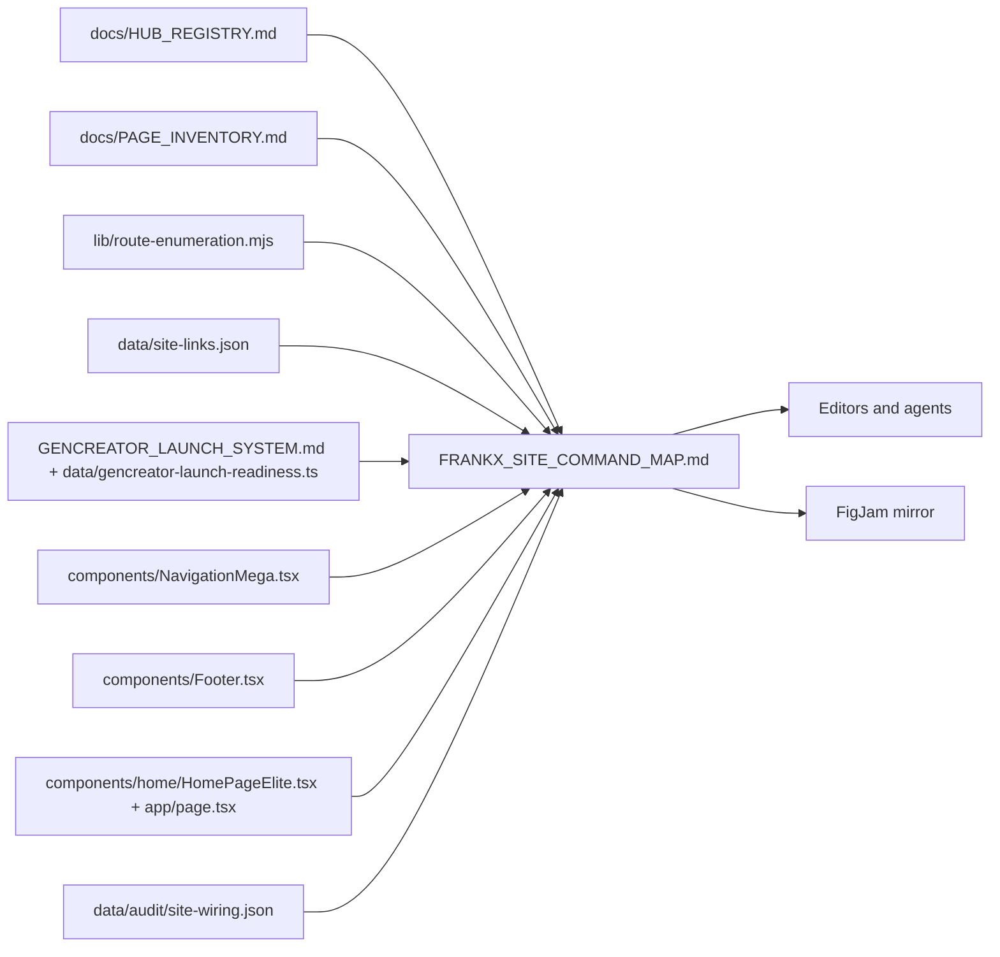
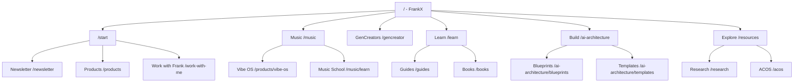

# FrankX Site Command Map

This is the repo-native source of truth for how frankx.ai should be wired. It connects route enumeration, public navigation, footer links, homepage shortcuts, funnel paths, commerce verification, aliases, and the FigJam mirror.

Sources: `lib/route-enumeration.mjs`, `data/site-links.json`, `data/gencreator-launch-readiness.ts`, `components/NavigationMega.tsx`, `components/Footer.tsx`, `components/home/HomePageElite.tsx`, `docs/HUB_REGISTRY.md`, `docs/GENCREATOR_LAUNCH_SYSTEM.md`, and the latest `data/audit/site-wiring.json` when present.

## Current Health

- Routes discovered: 665
- Redirect aliases: 22
- Latest audit: 2026-06-17T12:37:35.998Z
- Blocking findings: 0
- Warnings: 117
- Route types: core=21, tool=10, community=12, newsletter=1, workshop=7, section=349, static=15, video=3, research=3, library=4, os=5, partnership=3, product=16, blog=196, guide=20

## Source Map

## Public Hub Map

## Funnel Map

```mermaid
flowchart LR
  Discovery["Discovery: home, search, social, blog"] --> Orientation["Orientation: /start, /learn, /resources"]
  Orientation --> Trust["Trust: /about, /research, /library, /watch"]
  Trust --> Capture["Capture: /newsletter, downloads, assessments"]
  Capture --> Offer["Offer: products, workshops, coaching, work-with-me"]
  Offer --> Delivery["Delivery: downloads, email, checkout, booking"]
  Delivery --> Loop["Loop: newsletter, updates, community, product docs"]
```

## Canonical Commands

| Command | Route | Role | Surface | Status |
| --- | --- | --- | --- | --- |
| Discover | / | Primary arrival and personal brand promise | homepage, schema | canonical |
| Start | /start | First intentional path after discovery | nav CTA, homepage CTAs, footer | canonical |
| Create Music | /music | AI music portfolio and Suno proof | nav: Music, footer | canonical |
| Practice Music | /music/learn | Music School curriculum surface | nav: Music, command palette | canonical |
| Run Vibe OS | /products/vibe-os | Creative state management product and app entry | nav: Music, products | canonical |
| Become a GenCreator | /gencreator | Framework for generative creators | nav: GenCreators | canonical |
| Learn | /learn | Learning OS for courses, guides, books, assessment, watch | nav: Learn | canonical |
| Build | /ai-architecture | Blueprints, prototypes, templates, and enterprise architecture | nav: Build, homepage | canonical |
| Explore | /resources | Resource hub and ecosystem index | nav: Explore | canonical |
| Work with Frank | /work-with-me | Commercial studio, coaching, and collaboration path | footer, about, studio CTAs | canonical |
| Subscribe | /newsletter | Primary email capture and relationship loop | footer, homepage, product fallbacks | canonical |

## Commerce Map

Commerce links follow the verify-before-changing rule: paid-product CTAs are only migrated when a checkout destination and delivery path are confirmed.

| ID | Label | Kind | URL | Status | Owner action |
| --- | --- | --- | --- | --- | --- |
| vibe-os | Vibe OS | free-download | /products/vibe-os | verified |  |
| creators-soulbook | Creator's Soulbook | free-download | /soulbook | needs-verification | Confirm gated download and email delivery behavior. |
| creative-ai-toolkit | Creative AI Toolkit | paid-product | https://frankx.gumroad.com/l/creative-ai-toolkit | needs-verification | Confirm canonical checkout platform and delivery file before changing CTAs. |
| creation-chronicles | Creation Chronicles | paid-product | https://frankx.gumroad.com/l/creation-chronicles-creator | needs-verification | Confirm canonical checkout platform, tier links, and delivery pipeline. |
| bv-kit | BV Formation Kit | paid-product | https://frankxai.gumroad.com/l/bv-kit | needs-verification | Confirm Gumroad account/domain and whether Stripe or LemonSqueezy should replace it. |
| prompt-vault | Prompt Vault | paid-product | https://frankxai.gumroad.com/l/prompt-vault | needs-verification | Confirm Gumroad account/domain and whether Stripe or LemonSqueezy should replace it. |
| ai-architecture-templates | AI Architecture Templates | paid-product | /ai-architecture/templates | needs-verification | Fill verified checkout variant IDs before exposing buy buttons. |

## Alias And Duplicate Triage

| From | Canonical | Status | Reason |
| --- | --- | --- | --- |
| /music-school | /music/learn | verified | Music School is a public label; /music/learn is the existing route. |
| /agentic-creator-os | /products/agentic-creator-os | verified | Legacy product shorthand now resolves to the canonical Agentic Creator OS product page. |
| /ai-music-academy | /music/learn | verified | AI Music Academy CTAs now land on the public music learning hub. |
| /ai-architectures | /ai-architecture | verified | Permanent redirect already exists in next.config.mjs. |
| /ai-architect | /ai-architecture | verified | Permanent redirect already exists in next.config.mjs. |
| /links | /linktree | verified | Proxy redirects /links to /linktree. |
| /learning-paths | /learn | verified | Learning-path label now resolves to the consolidated Learn hub. |
| /for/founders | /for/creators | verified | Founder workshop CTAs now land on the existing creator audience page. |
| /toolkit | /products/creative-ai-toolkit | verified | Creator Toolkit ladder CTA now resolves to the existing Creative AI Toolkit product page. |
| /soul-frequency-assessment | /soul-frequency-quiz | verified | Redirect alias exists and quiz page is live. |
| /products/soulbook | /soulbook | verified | Permanent redirect already exists in next.config.mjs. |
| /vibe-os | /products/vibe-os | verified | Legacy shorthand now resolves to the canonical Vibe OS product page. |

## Latest Action Table

| Severity | Route | Source | Href | Status | Suggested fix |
| --- | --- | --- | --- | --- | --- |
| warning | /visionaries | rendered-html | https://karpathy.ai | missing-noopener | External link on /visionaries opens a new tab without noopener. |
| warning | /visionaries | rendered-html | https://simonwillison.net | missing-noopener | External link on /visionaries opens a new tab without noopener. |
| warning | /visionaries | rendered-html | https://profiles.stanford.edu/fei-fei-li | missing-noopener | External link on /visionaries opens a new tab without noopener. |
| warning | /visionaries | rendered-html | https://deepmind.google/about/people/demis-hassabis/ | missing-noopener | External link on /visionaries opens a new tab without noopener. |
| warning | /visionaries | rendered-html | https://www.andrewng.org | missing-noopener | External link on /visionaries opens a new tab without noopener. |
| warning | /visionaries | rendered-html | https://en.wikipedia.org/wiki/Brian_Eno | missing-noopener | External link on /visionaries opens a new tab without noopener. |
| warning | /visionaries | rendered-html | https://en.wikipedia.org/wiki/Rick_Rubin | missing-noopener | External link on /visionaries opens a new tab without noopener. |
| warning | /visionaries | rendered-html | https://vercel.com/about | missing-noopener | External link on /visionaries opens a new tab without noopener. |
| warning | /visionaries | rendered-html | https://huyenchip.com | missing-noopener | External link on /visionaries opens a new tab without noopener. |
| warning | /visionaries | rendered-html | https://aliabdaal.com | missing-noopener | External link on /visionaries opens a new tab without noopener. |
| warning | /visionaries | rendered-html | https://karpathy.ai | missing-noopener | External link on /visionaries opens a new tab without noopener. |
| warning | /visionaries | rendered-html | https://simonwillison.net | missing-noopener | External link on /visionaries opens a new tab without noopener. |
| warning | /visionaries | rendered-html | https://profiles.stanford.edu/fei-fei-li | missing-noopener | External link on /visionaries opens a new tab without noopener. |
| warning | /visionaries | rendered-html | https://deepmind.google/about/people/demis-hassabis/ | missing-noopener | External link on /visionaries opens a new tab without noopener. |
| warning | /visionaries | rendered-html | https://www.andrewng.org | missing-noopener | External link on /visionaries opens a new tab without noopener. |
| warning | /visionaries | rendered-html | https://en.wikipedia.org/wiki/Brian_Eno | missing-noopener | External link on /visionaries opens a new tab without noopener. |
| warning | /visionaries | rendered-html | https://en.wikipedia.org/wiki/Rick_Rubin | missing-noopener | External link on /visionaries opens a new tab without noopener. |
| warning | /visionaries | rendered-html | https://vercel.com/about | missing-noopener | External link on /visionaries opens a new tab without noopener. |
| warning | /visionaries | rendered-html | https://huyenchip.com | missing-noopener | External link on /visionaries opens a new tab without noopener. |
| warning | /visionaries | rendered-html | https://aliabdaal.com | missing-noopener | External link on /visionaries opens a new tab without noopener. |
| warning | /visionaries | rendered-html | https://en.wikipedia.org/wiki/A._R._Rahman | missing-noopener | External link on /visionaries opens a new tab without noopener. |
| warning | /visionaries | rendered-html | https://adamgrant.net | missing-noopener | External link on /visionaries opens a new tab without noopener. |
| warning | /visionaries | rendered-html | https://addyosmani.com | missing-noopener | External link on /visionaries opens a new tab without noopener. |
| warning | /visionaries | rendered-html | https://cohere.com/about | missing-noopener | External link on /visionaries opens a new tab without noopener. |
| warning | /visionaries | rendered-html | https://www.acquisition.com | missing-noopener | External link on /visionaries opens a new tab without noopener. |
| warning | /visionaries | rendered-html | https://www.andrewhuang.com | missing-noopener | External link on /visionaries opens a new tab without noopener. |
| warning | /visionaries | rendered-html | https://en.wikipedia.org/wiki/Angela_Duckworth | missing-noopener | External link on /visionaries opens a new tab without noopener. |
| warning | /visionaries | rendered-html | https://www.annieduke.com | missing-noopener | External link on /visionaries opens a new tab without noopener. |
| warning | /visionaries | rendered-html | https://www.aprildunford.com | missing-noopener | External link on /visionaries opens a new tab without noopener. |
| warning | /visionaries | rendered-html | https://lucumr.pocoo.org | missing-noopener | External link on /visionaries opens a new tab without noopener. |
| warning | /visionaries | rendered-html | https://www.bjfogg.com | missing-noopener | External link on /visionaries opens a new tab without noopener. |
| warning | /visionaries | rendered-html | http://worrydream.com | missing-noopener | External link on /visionaries opens a new tab without noopener. |
| warning | /visionaries | rendered-html | https://calnewport.com | missing-noopener | External link on /visionaries opens a new tab without noopener. |
| warning | /visionaries | rendered-html | https://en.wikipedia.org/wiki/Carol_Dweck | missing-noopener | External link on /visionaries opens a new tab without noopener. |
| warning | /visionaries | rendered-html | https://en.wikipedia.org/wiki/Charlie_Munger | missing-noopener | External link on /visionaries opens a new tab without noopener. |
| warning | /visionaries | rendered-html | https://profiles.stanford.edu/chelsea-finn | missing-noopener | External link on /visionaries opens a new tab without noopener. |
| warning | /visionaries | rendered-html | https://overreacted.io | missing-noopener | External link on /visionaries opens a new tab without noopener. |
| warning | /visionaries | rendered-html | https://thedankoe.com | missing-noopener | External link on /visionaries opens a new tab without noopener. |
| warning | /visionaries | rendered-html | https://en.wikipedia.org/wiki/Daniel_Kahneman | missing-noopener | External link on /visionaries opens a new tab without noopener. |
| warning | /visionaries | rendered-html | https://www.csail.mit.edu/person/daniela-rus | missing-noopener | External link on /visionaries opens a new tab without noopener. |
| warning | /visionaries | rendered-html | https://www.anthropic.com/team/dario-amodei | missing-noopener | External link on /visionaries opens a new tab without noopener. |
| warning | /visionaries | rendered-html | https://perell.com | missing-noopener | External link on /visionaries opens a new tab without noopener. |
| warning | /visionaries | rendered-html | https://deepmind.google/about/people/david-silver/ | missing-noopener | External link on /visionaries opens a new tab without noopener. |
| warning | /visionaries | rendered-html | https://en.wikipedia.org/wiki/Dieter_Rams | missing-noopener | External link on /visionaries opens a new tab without noopener. |
| warning | /visionaries | rendered-html | https://en.wikipedia.org/wiki/Don_Norman | missing-noopener | External link on /visionaries opens a new tab without noopener. |
| warning | /visionaries | rendered-html | https://eugeneyan.com | missing-noopener | External link on /visionaries opens a new tab without noopener. |
| warning | /visionaries | rendered-html | https://evanyou.me | missing-noopener | External link on /visionaries opens a new tab without noopener. |
| warning | /visionaries | rendered-html | https://en.wikipedia.org/wiki/Finneas_O%27Connell | missing-noopener | External link on /visionaries opens a new tab without noopener. |
| warning | /visionaries | rendered-html | https://en.wikipedia.org/wiki/Geoffrey_Hinton | missing-noopener | External link on /visionaries opens a new tab without noopener. |
| warning | /visionaries | rendered-html | https://hamel.dev | missing-noopener | External link on /visionaries opens a new tab without noopener. |

## FigJam Mirror

The Markdown map is canonical. The FigJam mirror is a presentation layer for whiteboarding and stakeholder review.

| Source | Target | Status | Notes |
| --- | --- | --- | --- |
| docs/FRANKX_SITE_COMMAND_MAP.md | [FrankX.AI Site Wiring Command Map](https://www.figma.com/board/kam8qW2tmvhFeVzpwyOgkd?utm_source=codex&utm_content=edit_in_figjam&oai_id=&request_id=88cb648b-70d2-4c6e-8960-1ed8f6dc9382) | created | Use the FigJam board for whiteboarding; keep docs/FRANKX_SITE_COMMAND_MAP.md as the canonical source. |

## Operating Rule

When a page or link is ambiguous, prefer: verify destination -> add registry entry -> add redirect/canonical -> update nav/footer/homepage -> rerun audit -> regenerate this map.

