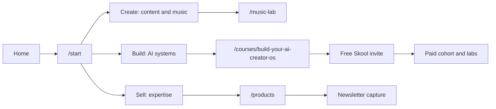

# GenCreator Launch System

This document is the source of truth for the GenCreator launch and offer strategy. It complements `docs/FRANKX_SITE_COMMAND_MAP.md`, which remains the wiring map for routes and links.

## Positioning

GenCreator by FrankX is the launch identity.

Core promise:

> GenCreator helps creators build personal AI operating systems that turn ideas into shipped work, audience, products, and revenue.

Brand order:

| Layer | Role | Launch stance |
| --- | --- | --- |
| GenCreator | Public movement and creator identity | Lead with this now |
| Agentic Creator | Advanced builder track inside GenCreator | Keep as one track, not a separate community |
| AI Architect Academy | Future umbrella for deeper education | Delay until GenCreator funnel is proven |

## User Paths

## Offer Ladder

| Tier | Price | Role | Offers |
| --- | --- | --- | --- |
| Free | $0 | Trust and capture | Starter Kit, newsletter, free Skool invite, Soulbook, books, 5 Suno prompts, assessment |
| Low-ticket | $27-$97 | First purchase | Suno Prompt Library, Creative AI Toolkit, Prompt Starter, Agentic Builder Pack |
| Flagship | $497 beta / $997 full | Core transformation | Build Your AI Creator OS |
| Advanced | $1,497-$2,500 | Technical acceleration | Agentic Creator Lab |
| High-ticket | from $4,800 | Done-with-you implementation | Creator Studio OS Sprint |

## Flagship Offer

**Build Your AI Creator OS** is the flagship paid offer.

Default beta framing:

- Price: $497 beta, $997 full.
- Format: 8-week implementation lab.
- Includes: 8 modules, weekly live labs, free Skool plus cohort channels, templates, Claude Code, n8n, MCP, Vercel, and one shipped public artifact.
- CTA until checkout is verified: waitlist/application, not buy now.

## Community

Launch one free Skool community first. Do not split GenCreator and Agentic Creator into separate communities yet.

Free channels:

- Start Here
- Wins
- AI Creator OS
- Music Lab
- Agentic Builder
- Office Hours

Paid Skool access only appears as part of cohorts, labs, or membership later. Paid newsletter waits until the free newsletter has 6-8 strong issues and a proven cadence.

## Product Readiness Matrix

Statuses are defined in `data/gencreator-launch-readiness.ts`.

| Status | Meaning | Public CTA rule |
| --- | --- | --- |
| ready | Checkout and delivery are verified | Buy/use CTA allowed |
| preview | Public content or app is useful, but some delivery claims need verification | Preview/read/use CTA allowed |
| waitlist | Sales concept exists but checkout or delivery is unverified | Waitlist/application CTA only |
| needs-build | Product data exists but route, demo, or deliverable is incomplete | Hide from shop or route to waitlist |
| paused | Useful later, not part of launch | Keep out of primary funnel |

Current high-priority items:

| Product | Status | Launch decision | Owner action |
| --- | --- | --- | --- |
| Build Your AI Creator OS | Flagship waitlist | Promote heavily | Add checkout only after cohort delivery and onboarding are ready |
| Vibe OS | Preview | Keep as free create-track proof | Verify downloadable guide or remove PDF promise |
| Agentic Creator OS | Preview | Advanced builder track | Sell lab/cohort later, not the open-source system itself |
| Creative AI Toolkit | Waitlist | Low-ticket candidate | Verify checkout, delivery, onboarding, and refund policy |
| Suno Prompt Library | Waitlist | Low-ticket music candidate | Verify Gumroad and deliverable files |
| Creation Chronicles | Waitlist | Consider as module inside flagship first | Do not hard-sell until delivery is real |
| Aurora UI Kit | Needs build | Hide from shop | Fold into Creator Website Templates unless demo/zip exists |
| Agentic Content Engine | Needs build | Hide from shop | Fold into Agentic Builder Pack unless demo/zip exists |

## Bundle Strategy

Do not sell many loose template packs as the main shop story. Bundle them into systems:

| Bundle | Price target | Includes | Status |
| --- | --- | --- | --- |
| Prompt Starter | $59 | Suno Prompt Library + Creative AI Toolkit | Needs verified checkout and delivery |
| GenCreator Toolkit | $97-$197 | Prompts, content workflows, launch checklist | Needs packaging |
| Agentic Builder Pack | $197-$297 | Claude Code skills, MCP configs, n8n workflows, agent blueprints | Needs packaging |
| Creator Website Templates | $97-$297 | Next.js creator site, blog CMS, product pages, newsletter capture | Needs demo and zip |

## Implementation Rule

No public page should present a missing or unverified paid product as "buy now." Use waitlist, preview, application, or contact CTAs until checkout and delivery are verified.

When a product changes status:

1. Update `data/gencreator-launch-readiness.ts`.
2. Verify checkout and delivery.
3. Update `data/site-links.json` if the destination is external or commerce-related.
4. Run the wiring audit.
5. Regenerate or update relevant docs.
