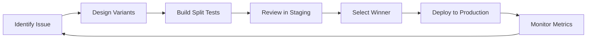

# Recommended Skills & Workflows

> Skills and workflows to enhance the Agentic Creator OS for design evolution and homepage optimization.

---

## Currently Available Skills

These skills were used to build the split tests:

| Skill | Purpose | When to Use |
|-------|---------|-------------|
| `/frankx-brand` | Brand voice, values, FrankX identity | Content creation, copy review |
| `/ui-ux-design-expert` | Design decisions, typography, layout | Visual design questions |
| `/frontend-design` | Component building, CSS, React | Building new components |
| `/agentic-orchestration` | Multi-agent coordination | Complex multi-step tasks |

---

## Recommended New Skills

### 1. `/split-test-designer`
**Purpose:** Design and document A/B tests for pages and components

**What it would do:**
- Generate split test variants automatically
- Create comparison documentation
- Track metrics and decisions
- Suggest winning elements to combine

**Example invocation:**
```
/split-test-designer homepage --variants=3 --focus="typography,positioning"
```

---

### 2. `/conversion-optimizer`
**Purpose:** Optimize CTAs, forms, and conversion flows

**What it would do:**
- Analyze current conversion rates
- Suggest CTA improvements
- A/B test button copy, colors, placement
- Recommend friction reduction

**Example:**
```
/conversion-optimizer --page=homepage --goal="email-signups"
```

---

### 3. `/design-system-builder`
**Purpose:** Manage and evolve design tokens

**What it would do:**
- Generate design tokens from existing CSS
- Suggest color palette refinements
- Manage typography scales
- Export to Tailwind config

**Example:**
```
/design-system-builder --audit --export-tokens
```

---

### 4. `/content-inventory`
**Purpose:** Track all content across the site

**What it would do:**
- Crawl pages and extract content structure
- Identify missing sections
- Track content freshness
- Generate content gaps report

**Example:**
```
/content-inventory --full-audit --output=docs/CONTENT_AUDIT.md
```

---

### 5. `/typography-advisor`
**Purpose:** Font selection and pairing guidance

**What it would do:**
- Analyze current font usage
- Recommend pairings based on brand
- Check font loading performance
- Suggest hierarchy improvements

**Example:**
```
/typography-advisor --compare="Geist,Inter,Playfair"
```

---

### 6. `/audience-pathway-designer`
**Purpose:** Design user journeys for different audiences

**What it would do:**
- Map audience segments to content
- Design navigation pathways
- Optimize for different user intents
- Track pathway completion rates

**Example:**
```
/audience-pathway-designer --segment="developers" --goal="agentic-os-purchase"
```

---

## Recommended Workflows

### Workflow 1: Homepage Evolution Cycle



**Skills involved:**
- `/ui-ux-design-expert` → Design variants
- `/frontend-design` → Build components
- `/split-test-designer` → Document tests
- `/conversion-optimizer` → Analyze results

---

### Workflow 2: Brand Voice Consistency

```
1. /frankx-brand --audit-page=/homepage
2. Review voice consistency score
3. Identify off-brand sections
4. Rewrite with brand guidelines
5. A/B test copy variants
```

---

### Workflow 3: Typography Decision

```
1. /typography-advisor --current-analysis
2. Research competitor fonts (WebSearch)
3. /ui-ux-design-expert --consult="font pairing"
4. Build preview page with options
5. Review and select
6. Update globals.css and layout.tsx
```

---

## Integration with Agentic Creator OS

These skills and workflows should be added to the Agentic Creator OS as:

### 1. Design Evolution Module
```
agentic-creator-os/
├── modules/
│   ├── design-evolution/
│   │   ├── split-test-designer.ts
│   │   ├── conversion-optimizer.ts
│   │   ├── typography-advisor.ts
│   │   └── design-system-builder.ts
```

### 2. Workflow Templates
```
agentic-creator-os/
├── workflows/
│   ├── homepage-evolution.yaml
│   ├── brand-consistency-audit.yaml
│   └── typography-decision.yaml
```

### 3. Documentation Standards
```
agentic-creator-os/
├── docs/
│   ├── DESIGN_EVOLUTION_TRACKER.md  ← Created
│   ├── SPLIT_TEST_LOG.md
│   └── TYPOGRAPHY_DECISIONS.md
```

---

## Quick Reference: Skill Activation

| Task | Skills to Activate |
|------|-------------------|
| Homepage copy review | `/frankx-brand` + `/ui-ux-design-expert` |
| New component design | `/frontend-design` + `/ui-ux-design-expert` |
| Font change | `/typography-advisor` + `/ui-ux-design-expert` |
| A/B test setup | `/split-test-designer` + `/frontend-design` |
| Conversion improvement | `/conversion-optimizer` + `/frankx-brand` |
| Full page redesign | All of the above |

---

## Next Steps

1. [ ] Review this document with Frank
2. [ ] Prioritize which skills to build first
3. [ ] Create skill templates in `.claude-skills/`
4. [ ] Add to Agentic Creator OS product
5. [ ] Document in Creation Chronicles

---

*Created: 2026-01-21*
*Part of Agentic Creator OS v3.0*
