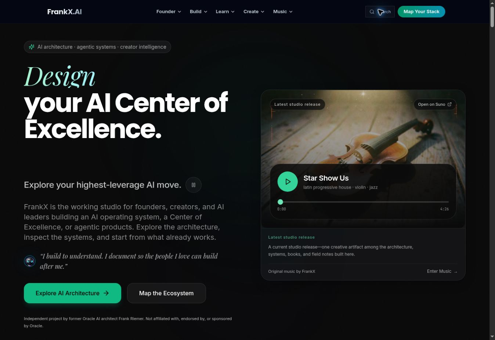

# FrankX living platform: source audit and preservation baseline

Date: 2026-09-09. Source baseline: `85e9feeff43b05c20a58e2f7ccabf35397b52454` in `frankxai/frankx.ai-vercel-website`.

This is an evidence document and proposed design brief. It does not authorize a homepage rewrite. No three visual directions have been selected or implemented; visual ideation has not begun because the required mobile capture is unavailable.

## Experience decision

Preserve FrankX as an authored public second brain and living studio: AI architecture, research, writing, books, music, visual work, products, experiments and human presence. Improve orientation, relationships and useful participation without collapsing the breadth into one framework or sales path.

The proposed primary entrances are **Starlight · GenCreator · Arcanea · Library · Music**, with **Search**, **Start here** and **All work** as utilities. These are a proposal, not the current production menu or approved implementation. Existing URLs remain intact. All work should expose the complete public catalog; each brand menu should introduce a clear purpose and selected useful destinations. Avoid treating a brand name as an unexplained category.

| Proposed entrance | Reader purpose | Preservation constraint |
|---|---|---|
| Starlight | Build memory, intelligence, agents and dependable systems | Keep AI architecture and existing system evidence directly reachable |
| GenCreator | Turn an idea into finished work | Preserve practical workflows, tools, templates and learning |
| Arcanea | Explore original stories, worlds and creative participation | Keep Arcanea mythology scoped to its brand surfaces |
| Library | Read, research and follow curated connections | Preserve the distinction between Frank's books and the reading collection |
| Music | Listen and explore releases and audiovisual work | Keep Music a primary entrance; media playback remains voluntary |

Operational readiness belongs in explicit evidence-backed states. A published route, an attractive image, or a source registry status is not proof that a workflow, purchase, download or agent is operational.

## Capture evidence and limitation

- The lead agent captured current production desktop at **1363 × 936** during this review session.
- The approved browser exposes no viewport setter. Browser UI shortcut attempts did not produce a mobile viewport. There is **no current mobile baseline** from this session.
- An isolated iframe capture harness was drafted, then rejected before publication because `next.config.mjs` sends `X-Frame-Options: DENY` and CSP `frame-ancestors 'none'`. Same-origin framing does not bypass these restrictions. The unused harness was removed; framing protections remain intact.
- Desktop evidence cannot substitute for mobile evidence. Obtain a supported mobile capture of the current production source before visual ideation, direction selection or a flagship redesign.

The current desktop first screen is preserved below. The accompanying [search baseline](evidence/frankx-search-before-20260909.jpg) records the existing grouping and unrelated priority results for “second brain.” A current mobile capture remains required for the eventual visual direction review.

## Typography: actual source and governance

`app/layout.tsx` loads Inter, Poppins, Playfair Display and JetBrains Mono through `next/font/google`, using `display: 'swap'`. Inter has weights 300–700; Poppins 600/700/800; Playfair normal and italic; JetBrains Mono is the utility face. `tailwind.config.js` maps these to sans, display, serif/quote and mono.

There is a concrete governance mismatch:

| Source | Rule currently written |
|---|---|
| Local `taste.md` | Inter body, Poppins display ≥18px, sparse Playfair italic, JetBrains Mono; dark first; no text animations |
| Canonical `starlight-design-intelligence/brand-packs/frankx/DESIGN.md` | Inter product UI; Poppins compatibility display; editorial faces selected from licensed specimens, with source-led palettes by surface mode |
| Canonical `brand-packs/frankx/SURFACE_MODES.md` | Distinct editorial/relationship, product/technical and soul/cultural modes |

Reconcile the chosen surface mode and font roles explicitly in the design proposal. Do not silently change all routes or inherit a new face by reflex. The user's current direction is clear: excellent typography and sentence-case interface copy, with no decorative all-caps treatment.

Source findings:

1. Playfair Display is loaded twice, under `--font-serif` and `--font-serif-editorial`. The latter variable is created by a constant named `sourceSerif`; the Tailwind fallback mentions Source Serif 4 although the loaded font is Playfair. Consolidate this naming/loading in a focused font change and verify actual network delivery and text wraps.
2. `HomePageElite.tsx` rotates H1 phrases with GSAP SplitText and measured reserved height. Local taste says type does not animate. The existing SSR and reduced-motion anchor is deliberate; preserve it while recording an explicit keep/change decision for the animated headline.
3. Audited desktop navigation uses 13px link labels and 11px descriptions; mobile uses 15px labels and 12px descriptions. The inspected navigation, mobile navigation and footer source contains no `uppercase` utility. All-caps is a user constraint, not a confirmed global defect from this audit.
4. Production font binaries are provided by Next's build output; no font binaries exist under `public/` in the inspected source. The repository's canvas-design authoring bundle contains other font specimens. Instrument Sans, Bricolage Grotesque and Crimson Pro have adjacent SIL OFL 1.1 records. Those files are inventory, not selected production faces. Specimens, full source/license correspondence, real weights, fallbacks and loading evidence are still required for a new selection.

Typography specimens must include FrankX, Starlight, GenCreator, Arcanea, numerals, long titles, paragraphs, italics, code and narrow mobile wraps. Use no more than two expressive families plus a monospaced utility face on a surface. Do not use faux weights or italics.

## Assets already available

The immediate asset opportunity is selection, continuity and context. The repository already has substantial imagery and character material. The following files are present; source byte size does not represent optimized delivered transfer size. This inventory does not independently approve a crop, likeness, rights record or publication state.

| Existing asset | Repository path | Source bytes |
|---|---|---:|
| Frank presenting | `public/images/portraits/frank-presenting-oracle-2025.jpg` | 298,649 |
| Frank-Omega guide | `public/images/mascot/frank-omega-pixar-v1.webp` | 298,012 |
| Frank-Omega thinking | `public/images/mascot/frank-omega-thinking-v1.png` | 1,351,489 |
| Frank-Omega pointing | `public/images/mascot/frank-omega-pointing-v1.png` | 1,316,570 |
| Track artwork | `public/images/music/star-show-us.jpg` | 155,312 |
| Arcanea scene used by homepage | `public/images/arcanea/eldrian-conclave-20260301.webp` | 853,482 |
| GenCreator artwork | `public/images/gencreator/gencreator-framework-hero.webp` | 355,766 |
| Existing studio artwork | `public/images/design-lab/nature-01-digital-garden-hero.png` | 744,957 |

Ten non-thumbnail Frank-Omega masters exist, alongside Axi and other droid designs. Select one consistent character identity before adding poses, voice or guidance. Distinguish documentary photographs, generated portraits and an AI guide's responses.

Existing ownership surfaces should be extended:

- `data/visual-asset-ledger.json` describes the June batch of 172 assets for 43 posts, including source paths, review and deployment states, derivative types, and optional delivery links.
- `data/music-asset-registry.json` describes 61 tracks, carries a March 4 timestamp, and includes sampled Vercel Blob audio references plus Suno embeds and covers. Its metadata reports zero linked video. These are stored references, not fresh playback or catalog-completeness verification.
- `data/music/suno-catalog.json`, `data/music/catalog.csv`, `data/music/release-approvals.json` and `scripts/music/build-asset-registry.mjs` already exist.
- Only one video was found under `public/`: `public/videos/blog/aeo-citation-flow-viz.mp4`, 4,520,665 bytes. External video inventory was not audited, so this is not the total media catalog.

## Graph and discovery: actual foundation

The site already has several distinct graph-related structures. They should have explicit responsibilities rather than be treated as one authoritative knowledge graph.

| Existing source | Verified scope | Design implication |
|---|---|---|
| `data/route-index.json` | 1,001 routes, 58 aliases, 629 routes with no nonempty description | Improve public descriptions and routing before expecting a new visual map to explain every item |
| `lib/site-search.ts` | Local route search with manually defined groups and shortcuts | Shared navigation taxonomy and search ranking need deliberate coordination |
| `lib/sitemap/build-graph.ts` | Route and image nodes; `uses` and `shares-image` edges; categories inferred from paths | Useful asset relationship map; shared imagery does not establish semantic or evidential relationships |
| `data/visual-registry.json` | 529 visual records in this checkout | Existing visual inventory can seed media discovery |
| `data/sitemap-image-map.json` | 268 pages; generated March 21 | Its coverage and state should be refreshed against the current route inventory |
| `data/audit/link-graph.json` | 302 nodes, 742 edges; generated March 28 | Historical source-link audit, not a current 1,001-route production crawl |
| `docs/research/graph-engineering-source-ledger.md` | Existing research and conceptual distinctions | Prior research exists; its claims are not revalidated by this source audit |

`app/layout.tsx` attempts to read `public/schema-graph.json` and gracefully omits that injection when unavailable. That generated file is absent from the inspected checkout. This does not establish that production lacks structured data: `OrganizationJsonLd` and route-specific metadata are separate mechanisms and require rendered verification.

The next graph design should distinguish canonical works, media assets, sources, claims, projects, workflows and curated anthologies. Proposed relationships include inspired-by, cites, produced-with, version-of and part-of. Their evidence, ownership, public visibility and review status should be explicit. Do not infer those relationships solely from image reuse or route prefixes. A readable related-work list must remain available alongside a visual graph.

## Preservation matrix

These are source-backed baseline requirements, not approved visual treatments. No removal is authorized by this document.

| Value dimension | Current evidence | Required treatment | Review evidence still needed |
|---|---|---|---|
| Identity and voice | FrankX hero, AI Architect authorship, personal and guide imagery | Preserve Frank as builder, musician, author and human | First-screen copy and both viewport captures |
| AI architecture authority | Homepage architecture feature and `/ai-architecture` | Direct route with inspectable technical proof | Current destination and mobile prominence |
| Music and creative proof | `FeaturedTrackPlayer`, Music entrance, Arcanea scene and design gallery | Preserve primary music access and contextual creative work | Playback, keyboard, loading and no autoplay |
| Products and tools | Homepage product and build routes | Preserve discovery; label availability truthfully | Actual use and purchase readiness checked separately |
| Books, library and articles | Authored books, reading library and latest articles | Keep their distinct functions visible and connected | Title wraps, catalog density and routing |
| Founder pathways | Founder Stack, Foundry, Circle and architecture | Useful founder paths remain within broader authorship | Task routing and current destinations |
| Human Layer boundaries | Dedicated hub and evidence classes | Keep claims governed and private material permissioned | Content boundary review |
| Conversion/newsletter | Email forms and newsletter routes | Preserve a voluntary next step alongside useful free work | Success/error states; delivery checked separately |
| Accessibility/motion | SSR heading anchor, reduced-motion and keyboard patterns | Preserve readable alternatives and complete static states | Narrow mobile, tablet, focus, zoom and reduced motion |
| SEO/structured data | Canonicals, root metadata and graph-loading path | Preserve URLs, indexability and crawlable relationships | Rendered metadata, structured data and route checks |

## Next design decision and repository gates

The next design decision is the **primary composition and surface mode for FrankX's living studio**, expressed through exactly three materially different, asset-grounded directions. It is not a choice to reduce the whole site to one offer. Each direction must include typography specimens, desktop and mobile composition, brand navigation treatment, media behavior and the preservation matrix. Frank selects the direction; agents do not apply their own approval signal.

Before that comparison, complete the current mobile baseline through a supported capture capability. Then follow the active repository contract:

1. Classify homepage work as copy polish, additive enhancement, section-level change or structural replacement.
2. Section-level or structural work requires current desktop/mobile captures, the completed preservation matrix, exactly three reviewed directions and Frank's explicit selection before implementation.
3. Structural replacement additionally requires a contract-only PR reviewed and merged by Frank before a separate implementation PR. Never rewrite `scripts/tests/homepage-mind-palace-contract.test.mjs` in the homepage implementation PR.
4. Keep homepage work isolated from navigation, APIs, access control, payments, unrelated routes and broad migrations. A shared brand-navigation change needs its own reviewable scope.
5. Use an isolated agent branch and draft-first PR. Before code push, run `pnpm run type-check`, `pnpm run lint`, `pnpm run ai-slop:audit:strict` and `pnpm run build`; use the required broader gate when applicable. Never push directly to `main`.
6. Record reviewed copy, licensed typography, motion/reduced-motion, mobile, accessibility, performance, URL, analytics and independent visual verification. Vercel deployment remains through the repository's native git integration.
7. After authorized merge, verify the actual production URL and record commit, checks, deployment evidence and rollback target.

Canonical sources: local `AGENTS.md`, `design.md`, `taste.md`, `docs/strategy/HOMEPAGE-PRESERVATION-CONTRACT.md`; cross-repository `frankxai/starlight-design-intelligence/skills/world-class-web-release/SKILL.md`, `brand-packs/frankx/{BRAND,COPY,DESIGN,MOTION,SURFACE_MODES,TOKENS}.md`, and `evals/web-release-gate.md`.

Status: source audit and proposed preservation baseline complete. Mobile evidence, three-direction review, visual selection, implementation and production verification are incomplete. This document does not change production behavior.
