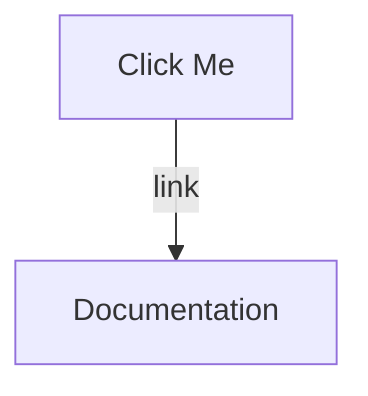
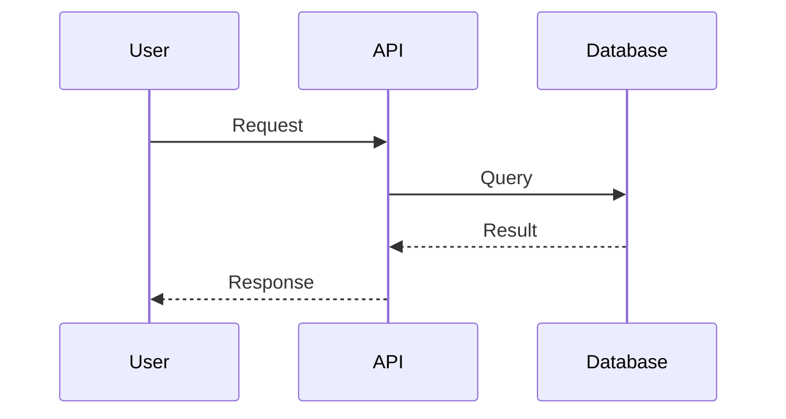
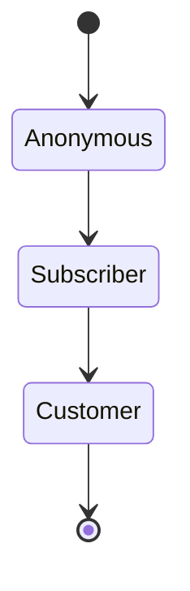
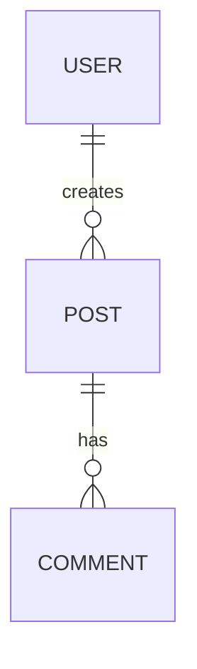
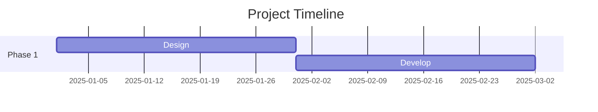
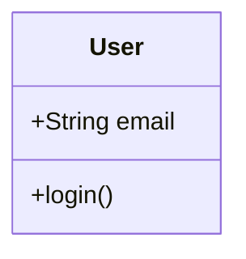

# Diagram Improvements & Additional Diagrams

## Current Diagrams - Enhancement Opportunities

### Visual Improvements Possible
- [ ] Add click events to link to documentation
- [ ] Use dashed lines for "optional" relationships
- [ ] Use dotted lines for "suggested" relationships
- [ ] Add notes/annotations for complex areas
- [ ] Improve color contrast for accessibility
- [ ] Add legends to complex diagrams
- [ ] Use more strategic emoji placement

### Technical Improvements
- [ ] Split large diagrams into focused views
- [ ] Add zoom regions for detail areas
- [ ] Create "layers" (high-level → detailed)
- [ ] Add timestamps/version info

## Recommended Additional Diagrams

### High Priority

#### 13. User Interaction Sequences (Sequence Diagram)
**Purpose:** Show time-based interactions for key user flows
**Flows to visualize:**
- User signup → Guardian selection → First post
- Vibe OS session creation → Payment → Delivery
- Course enrollment → Onboarding → First module
- Newsletter signup → Welcome sequence → First purchase

#### 14. Database Schema (ER Diagram)
**Purpose:** Complete database structure with relationships
**Tables to map:**
- Users, Posts, Guardians, Realms, Circles
- Relationships, foreign keys, indexes
- Arcanea vs FrankX main schemas

#### 15. API Endpoint Map (Sequence + Component)
**Purpose:** All API endpoints with request/response flows
**Categories:**
- Auth endpoints
- Content endpoints
- AI integration endpoints
- Payment endpoints
- Webhook endpoints

#### 16. Application State Machine (State Diagram)
**Purpose:** User states and transitions
**States:**
- Anonymous → Interested → Subscriber → Customer → Member → Advocate
- Post states: Draft → Review → Published → Archived
- Guardian conversation states

#### 17. Deployment Pipeline (Sequence Diagram)
**Purpose:** Complete CI/CD flow
**Steps:**
- Git push → Tests → Build → Preview → Approve → Deploy → Monitor
- Rollback procedures
- Environment promotion

#### 18. Project Roadmap (Gantt Chart)
**Purpose:** Timeline for all initiatives
**Tracks:**
- Arcanea development phases
- AI Music Academy launch
- Vibe OS sessions release schedule
- Content calendar
- Product launches

### Medium Priority

#### 19. Security Architecture
**Purpose:** Authentication, authorization, data protection
**Components:**
- Auth flows (Supabase Auth)
- RLS policies
- API security (rate limiting, CORS)
- Data encryption
- Backup/recovery

#### 20. Email Automation Flows (Sequence Diagram)
**Purpose:** All email sequences mapped
**Sequences:**
- Welcome series
- Course onboarding
- Abandoned cart
- Re-engagement
- Upsell campaigns

#### 21. Social Media Workflow
**Purpose:** Content creation to posting pipeline
**Platforms:**
- X/Twitter strategy
- LinkedIn approach
- YouTube workflow
- Spotify releases

#### 22. Analytics Dashboard Structure
**Purpose:** Metrics tracking and visualization
**Categories:**
- User metrics (signups, engagement)
- Revenue metrics (MRR, LTV)
- Content metrics (views, conversions)
- Product metrics (course completions)

#### 23. Error Handling & Monitoring
**Purpose:** How errors are caught and resolved
**Flow:**
- Error detection → Logging → Alerting → Triage → Fix → Deploy

#### 24. Mobile App Architecture (Future)
**Purpose:** Native mobile experience
**Platforms:**
- iOS architecture
- Android architecture
- React Native considerations

### Lower Priority (Nice to Have)

#### 25. Git Branching Strategy
**Purpose:** Development workflow
**Branches:**
- main, develop, feature/*, hotfix/*
- PR process
- Merge strategies

#### 26. Design System Components
**Purpose:** UI component library map
**Categories:**
- Atoms, Molecules, Organisms
- Design tokens
- Component relationships

#### 27. Testing Strategy
**Purpose:** Quality assurance approach
**Layers:**
- Unit tests
- Integration tests
- E2E tests
- Visual regression

#### 28. Content Taxonomy
**Purpose:** How content is categorized
**Structure:**
- Blog categories/tags
- Course structure
- Book genres
- Music genres

#### 29. Partner Integration Map
**Purpose:** Third-party services
**Integrations:**
- Stripe, Gumroad
- Email providers
- Social platforms
- Analytics tools

#### 30. Accessibility Compliance
**Purpose:** WCAG 2.1 AA compliance map
**Areas:**
- Color contrast
- Keyboard navigation
- Screen reader support
- ARIA labels

## Mermaid Advanced Features Not Yet Used

### Interactive Features


### Styling Enhancements
```mermaid
%%{init: {'theme':'dark', 'themeVariables': { 'primaryColor':'#9B4AE2'}}}%%
```

### Sequence Diagrams


### State Diagrams


### Entity Relationship


### Gantt Charts


### Class Diagrams


## MCP Integration Opportunities

### Current MCPs Available
- **Nano Banana**: Could generate custom diagram images/icons
- **GitHub MCP**: Could auto-generate diagrams from code
- **Figma MCP**: Could sync with design system

### Potential Custom MCP
**Mermaid Diagram Generator MCP**
- Auto-generate diagrams from codebase analysis
- Update diagrams when code changes
- Generate interactive diagrams with live data
- Export in multiple formats
- Validate diagram syntax

### Should We Build It?
**Pros:**
- Automated diagram updates
- Consistency across diagrams
- Integration with documentation
- Live data visualization

**Cons:**
- Development time investment
- Maintenance overhead
- Current manual approach works well

**Recommendation:** Not needed yet. Current approach with manual Mermaid + exports works great. Consider if we scale to 50+ diagrams.

## Action Items

### Immediate (Do Now)
1. Create sequence diagrams for top 3 user flows (#13)
2. Create database ER diagram (#14)
3. Add click events to existing diagrams

### Short Term (This Week)
4. Create deployment pipeline diagram (#17)
5. Create project roadmap Gantt chart (#18)
6. Enhance existing diagrams with better styling

### Medium Term (This Month)
7. API endpoint map (#15)
8. Security architecture (#19)
9. Email automation flows (#20)
10. Analytics dashboard structure (#22)

### Long Term (As Needed)
- Remaining diagrams based on priority
- Regular updates to existing diagrams
- Consider custom MCP if scaling needs arise

## Visual Enhancement Checklist

For each existing diagram:
- [ ] Add descriptive tooltips
- [ ] Improve color accessibility (WCAG AA)
- [ ] Add legends where needed
- [ ] Use consistent icon strategy
- [ ] Add click-through links to docs
- [ ] Optimize for both light/dark themes
- [ ] Add version numbers
- [ ] Include "last updated" timestamp

## Questions for Frank

1. Which 5 additional diagrams would be most valuable right now?
2. Should we prioritize user-facing flows or technical architecture?
3. Do you want interactive diagrams with click-through links?
4. Should we create presentation-ready versions (16:9 aspect ratio)?
5. Do you need printable versions (PDF, high-res PNG)?
